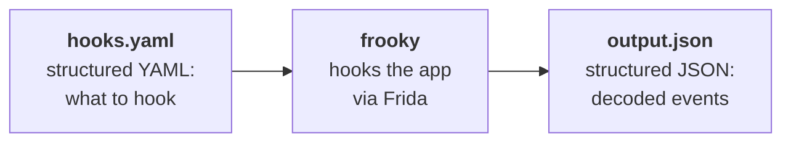

# Frooky

```txt
   ___    ____
  / __\  / _  |    _     _    _  _   _   _
 / _\   | (_) |  / _ \ / _ \ | / /  | | | |
/ /     / / | | | (_) | (_) ||  <   | |_| |
\/     /_/  |_|  \___/ \___/ |_|\_\  \__, |
                                     |___/
```

 [](https://github.com/bernhste/frooky/actions/workflows/verify-host.yml) [](https://github.com/bernhste/frooky/actions/workflows/test-host-android.yml) [](https://github.com/bernhste/frooky/actions/workflows/test-agent-android.yaml)



`frooky` is a [Frida](https://www.frida.re/)-based dynamic analysis tool for Android and iOS apps with the purpose of simplifying function hooking and runtime data decoding.

- Hook Java/Kotlin methods and native C/C++ functions (Objective-C/Swift support for iOS is planned)
- Structured YAML input for hook declarations
- Structured NDJSON output for easy event processing
- Support for method overloads and stack trace capture
- Argument capture with various data types
- Return value capture with various data types
- Filter hooks by argument values or stack trace patterns

## Installation

Install the `frooky` CLI tool via uv or pip:

```bash
uv tool install frooky
# or
pip install frooky
```

## Usage

Create a hook file (e.g., `hooks.yaml`) with the functions and/or methods you want to hook.

Read all about the [Structure of a Hook File](#structure-of-a-hook-file) or use the [documented examples](./docs/examples/README.md) as a quick starting point.

After you created the desired hook file, run `frooky`:

```bash
# Attach by app name and show the events on the terminal
frooky -U -n org.owasp.mastestapp resilience.yaml -e

# Attach to the frontmost application and load an additional script
frooky -U -F webview.yaml -l disable-flutter-tls.js

# Spawn and load multiple hook files (hooks are merged) and show very verbose output
frooky -U -f org.owasp.mastestapp storage.yaml crypto.yaml -vv

# Spawn and load multiple hook files using globs (hooks are merged) and use V8 JavaScript engine
frooky -U -f org.owasp.mastestapp hooks_platform_*.yaml --runtime v8

# Watch the hook files and apply changes while the app keeps running
frooky -U -f org.owasp.mastestapp biometry.yaml -w
```

See `frooky -h` for all options.

## Structure of a Hook File

frooky uses _hook files_, which are structured YAML files including declarations of methods or functions to be hooked.

A hook file consists of optional metadata and a list of _hook declarations_ called `hookCollection`. The following YAML file describes the basic structure:

```yaml
metadata:                         # All metadata is optional
  name: <name>                    # Name of the hook collection
  platform: Android|iOS           # Target platform (hooks must be platform-specific)
  description: <description>      # Description of what the hook collection does
  category: <category>            # Category of the hook collection
  author: <author>                # Your name or organization
  version: <version>              # Version number of the hook collection (e.g., 1)

settings:                         # Optional. Default hookSettings/decoderSettings applied to all hook declarations
  hookSettings: { ... }
  decoderSettings: { ... }

hookCollection:                   # Collection of hook declarations
  - <hook_declaration>
```

## Hook Declaration

Depending on the platform, the `<hook_declaration>` may look different. Please read the linked platform-specific documentation for more information.

At the moment, frooky supports these types of hooks:

| Hook Type    | Platform    | Description                                 | Documentation                                                 |
| ------------ | ----------- | ------------------------------------------- | ------------------------------------------------------------- |
| `JavaHook`   | Android     | Hook for Java/Kotlin methods                | [`JavaHook`-Declaration](./docs/java-hook-declaration.md)     |
| `NativeHook` | Android/iOS | Hook for native functions (C/C++/Rust etc.) | [`NativeHook`-Declaration](./docs/native-hook-declaration.md) |

> [!NOTE]
> iOS support is not yet complete. Hooks for Objective-C and Swift methods are [planned](https://github.com/bernhste/frooky/tree/feature/ios-agent-poc). Until then, you can use the `NativeHook` with iOS.

## Parameter- and Return-Type Declaration

frooky can decode data passed to functions or methods via arguments, including their return values.

Depending on the value types, this can be simple or more complex. frooky tries to decode arguments and return values by itself if possible. But in some cases, e.g. when the value is simply a native pointer, it is necessary to provide information about the types used. Before writing a hook declaration, it is therefore recommended to read the following documentation:

- [Parameter Declaration](docs/parameter-declaration.md)
- [Return Type Declaration](docs/return-type-declaration.md)
- [Decoders](docs/decoders.md)
  - [Decoders for Android Java Hooks](docs/decoders-java.md)
  - [Decoders for Native Hooks](docs/decoders-native.md)

## Example

We'll use the OWASP MAS [MASTG-DEMO-0106](https://mas.owasp.org/MASTG/demos/android/MASVS-RESILIENCE/MASTG-DEMO-0106/MASTG-DEMO-0106/) app to demonstrate hooking a cryptographic en-/decryption method.

First you need to create a hook file, e.g., `cipher_dofinal.yaml`:

```yaml
metadata:
  name: Android Cipher doFinal Hook
  platform: Android
  description: Captures the plaintext/ciphertext passed to Cipher#doFinal during en-/decryption decoded as string.
  category: CRYPTO
  author: frooky dev team
  version: 1

hookCollection:
  - javaClass: javax.crypto.Cipher
    hookSettings:
      platformStackTrace: true
    hooks:
      - [ doFinal, {decoder: "string"} ]
```

Then run `frooky` with the hook file against your target app:

```bash
frooky -U -f org.owasp.mastestapp cipher_dofinal.yaml
```

Events are written to the output file as newline-separated batches, each line a JSON array of the events captured in that batch (see [Understanding Output Format](./docs/output.md) for the full schema). A single event, pretty-printed:

```json
{
    "id": "0a6c400a-a7fe-44ab-8842-d1e4a67e0487",
    "timestamp": "2026-09-16T06:20:33.163Z",
    "type": "hook-java",
    "javaClassName": "javax.crypto.Cipher",
    "method": "doFinal",
    "fieldType": {
        "fieldType": "instance"
    },
    "stackTrace": {
      "platformStackTrace": [
        "javax.crypto.Cipher.doFinal (Cipher.java:2066)",
        "org.owasp.mastestapp.MastgTest.mastgTest (MastgTest.kt:58)",
        "org.owasp.mastestapp.MainActivityKt.MainScreen$lambda$12$lambda$11 (MainActivity.kt:101)",
        "org.owasp.mastestapp.MainActivityKt.$r8$lambda$Pm6AsbKBmypP53K-UABM21E_Xxk (MainActivity.kt:-1)",
        "org.owasp.mastestapp.MainActivityKt$$ExternalSyntheticLambda3.run (D8$$SyntheticClass:0)"
      ],
      "nativeStackTrace": []
    },
    "argsIn": [
        {
            "type": "[B",
            "value": ".5}....!(.L;(...KY.ly.Pd.`2.uT.....x.C?."
        }
    ],
    "argsOut": [],
    "returnValue": {
        "type": "[B",
        "value": "We ❤️ OWASP MAS 📱"
    }
}
```

## More Information

Please refer to the following documentation for more information about various topics:

- [Understanding Output Format](./docs/output.md)
- [Additional Settings and Best Practices](./docs/additional-features.md)
- [Development / Local Testing](./docs/develop.md)
- [Under the Hood: Agent Start and Hook Loading](./docs/under-the-hood.md)
