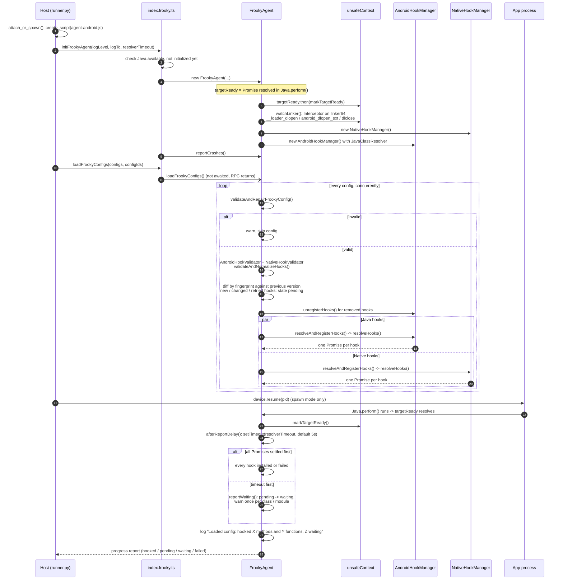
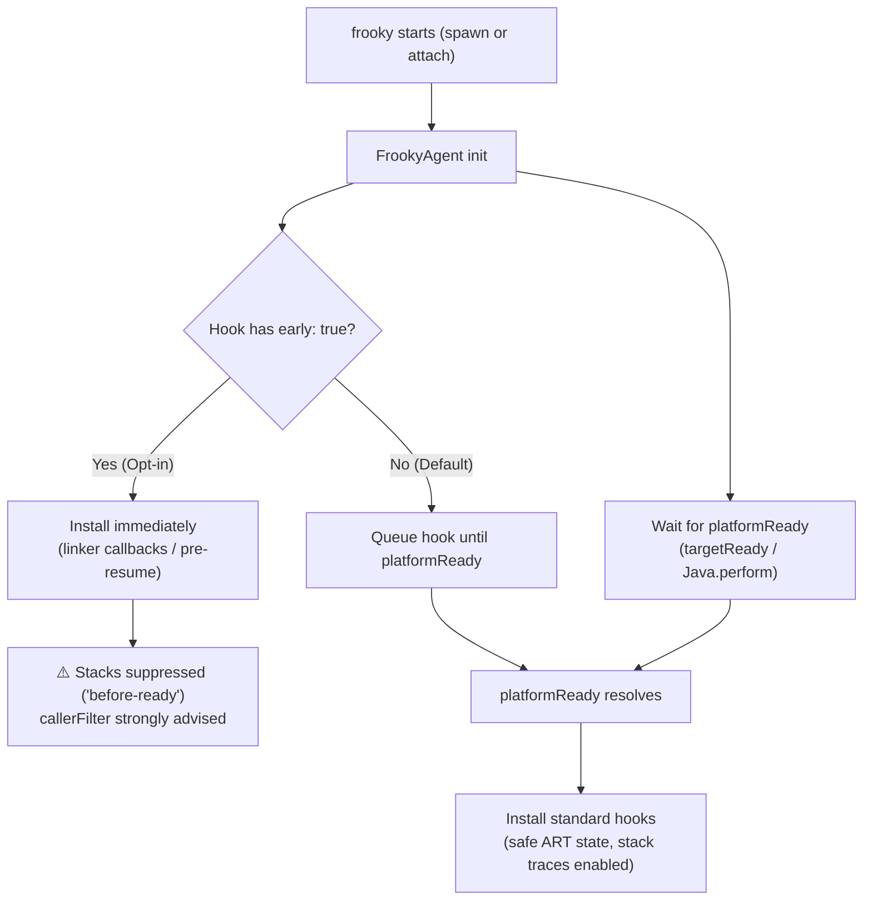
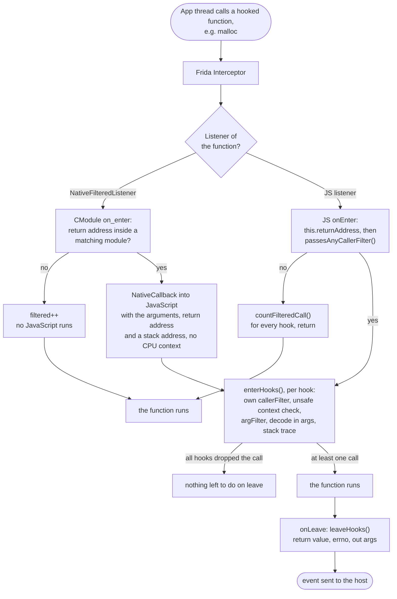
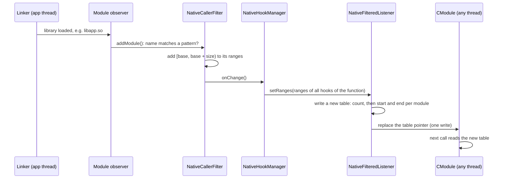

# Under the Hood

This page explains what happens between starting frooky and the moment every hook of your hook files is installed, waiting, or failed, and how a hook's `callerFilter` decides which calls it records. It helps to understand why a hook shows up as `waiting`, why some hooks fire before the app's own code runs, why a filtered hook can still slow the app down, and where to look in the source when something doesn't get hooked.

> [!NOTE]
> For now, this page describes the Android agent. iOS support is not yet complete, see the [README](../README.md).

<!-- TOC -->

- [Overview](#overview)
- [Agent Start and Config Loading](#agent-start-and-config-loading)
  - [Starting the Agent](#starting-the-agent)
  - [Loading the Hook Files](#loading-the-hook-files)
  - [Resuming the App and the Resolver Timeout](#resuming-the-app-and-the-resolver-timeout)
  - [Hooking Stages and Capabilities](#hooking-stages-and-capabilities)
- [Caller Filters](#caller-filters)
  - [The Path of a Native Call](#the-path-of-a-native-call)
  - [Which Listener a Function Gets](#which-listener-a-function-gets)
  - [Keeping the Module Ranges Current](#keeping-the-module-ranges-current)
  - [Java Hooks](#java-hooks)
- [Where to Find It in the Source](#where-to-find-it-in-the-source)

<!-- /TOC -->

## Overview

frooky has two parts:

- The **host** (Python) runs on your machine. It parses the command line, connects to the device, reads your hook files and writes `output.json`.
- The **agent** (TypeScript) is injected into the app by Frida. It validates the hook files, finds the classes, methods and functions they declare, installs the hooks and decodes the values.

The host starts the agent and hands it the hook files over Frida's RPC. Everything after that, from validating the hook files to installing the hooks, happens inside the app's process.

## Agent Start and Config Loading



### Starting the Agent

The host attaches to the app (`-p`/`-n`) or spawns it (`-f`). When spawning, Frida starts the app suspended, before any of its code runs. The host then loads the agent script and calls `initFrookyAgent` (steps 1 to 4).

The `FrookyAgent` constructor sets up everything the hooks need later:

- **`targetReady`** is a promise that resolves once `Java.perform()` runs its callback, i.e. once the app's own classes can be looked up. In spawn mode, that is only after the app has been resumed.
- **`watchLinker()`** hooks the linker's `dlopen()`/`dlclose()` entry points to know which threads are currently loading a library. While a thread is loading a library, hooks don't capture stack traces, neither on that thread nor on any other (see [Skipped Stack Traces](./additional-features.md#skipped-stack-traces)). It is installed first, so it covers the libraries that load while the hook files are processed.
- One **hook manager** per hook type: `AndroidHookManager` for Java hooks, with a `JavaClassResolver` that finds classes in every class loader, and `NativeHookManager` for native hooks.

Finally, `reportCrashes()` installs the [Native Crash Reporter](./additional-features.md#native-crash-reporter), except under V8.

### Loading the Hook Files

The host passes all hook files at once to `loadFrookyConfigs` (step 10). The RPC call returns right away and doesn't wait for the hooks: in spawn mode, the app stays suspended only as long as the host waits for this call.

Each hook file is then processed on its own, all of them concurrently:

1. **Validation:** `validateAndRepairFrookyConfig()` checks the file against the schema. An invalid file is skipped with a warning; the other files still load. The Java and native validators then normalize each hook declaration, e.g. expand shorthands and merge the [settings](./additional-features.md#settings-precedence), and drop invalid declarations with a warning.
2. **Diff:** every normalized declaration gets a fingerprint. On a [reload](./additional-features.md#hot-reloading-and-watch-mode), unchanged declarations keep their installed hooks, removed ones are unhooked, and only new, changed or retried ones are resolved. On the first load, every declaration is new and starts in the state `pending`.
3. **Resolve and install:** the Java and native declarations go to their hook managers in parallel. `resolveHooks()` returns one promise per declaration, which settles once its class or module is found and its hooks are installed, or once it is clear that the method or symbol doesn't exist.

By default, native hooks are gated behind `platformReady` (`targetReady`), waiting for the platform runtime (ART) to initialize before attaching interceptors. This prevents early bootstrap deadlocks and ANRs. Hooks with `early: true` opt into immediate installation during Stage 1 (spawn pause) or Stage 2 (dynamic linker loading before constructors or `JNI_OnLoad` run).

### Resuming the App and the Resolver Timeout

In spawn mode, the host now resumes the app (step 21). The app starts, `Java.perform()` runs, and `targetReady` resolves. From then on, standard native hooks are installed, and the `JavaClassResolver` also looks into the app's own class loaders.

At the same moment, the resolver timeout starts: `-t`/`--resolver-timeout` seconds, 5 by default (see [Dynamic Class and Module Resolution](./additional-features.md#dynamic-class-and-module-resolution)). Then one of two things happens first:

- **All promises settle:** every declaration is `installed` or `failed`.
- **The timeout fires:** declarations that are still `pending` become `waiting`, with one warning per class or module they wait for.

Either way, frooky logs a summary per hook file, e.g. `Loaded hooks.yaml: hooked 12 methods and 3 functions, 1 waiting`, and reports the counts to the host's status bar. The timeout doesn't stop anything: waiting hooks stay registered and are installed as soon as their class or module loads.

### Hooking Stages and Capabilities

The table below summarizes what can be hooked and accessed across the app's lifecycle:

| Stage | What can be hooked | What is risky or blocked | Stack traces available? |
| :--- | :--- | :--- | :--- |
| **Stage 1: Frooky init** (process paused at spawn) | Opt-in via `early: true`: modules already mapped (`libc.so`, `libdl.so`), or app modules when attaching (`-n`) | ❌ High-risk Bionic primitives (`read`, `close`) without `callerFilter` collide with ART bootstrap threads on ARM64; Java hooks cannot install yet (VM not initialized, queued as `pending`) | ❌ No stack traces (`detectUnsafeContext()` returns `"before-ready"`) |
| **Stage 2: Resume & linker** (process resumed, ART booting) | Opt-in via `early: true`: dynamically loaded app `.so` libraries as the linker loads them, before `.init_array` / `JNI_OnLoad` | ❌ Hooking functions actively executing inside the dynamic linker (`linker-busy` / `in-linker`) without `callerFilter` risks ANRs | ❌ No stack traces (blocked by `"in-linker"`, `"linker-busy"`, or `"before-ready"`) |
| **Stage 3: Platform ready** (`targetReady` / `Java.perform()`) | ✅ Default target for standard hooks: all Java and Kotlin methods; low-level native hooks (safe once ART daemon threads settle) | ⚠️ Hot-path libc functions (`malloc`, `free`, `memcpy`) still benefit from `callerFilter` to reduce event volume | ✅ Platform (Java) stack traces available; native stack traces available (guarded by `detectUnsafeContext` on low stack) |
| **Stage 4: App steady state** (activities and UI running) | ✅ Everything (Java, Kotlin, native symbols, offsets) | ⚠️ Functions in `BLOCKED_FUNCTIONS` (e.g. `pthread_getspecific`, `dlopen`) | ✅ Full stack traces (Java + native) |



## Caller Filters

A hook's [`callerFilter`](./additional-features.md#caller-filters) decides for every call whether the hook records it. Most calls of a hot function come from code you aren't interested in, so the filter mostly drops calls. What a dropped call costs depends on where the filter runs: in native code, or in JavaScript after Frida has entered the JS engine.

### The Path of a Native Call

frooky attaches one Frida Interceptor listener per hooked function, no matter how many hooks and hook files declare it. That listener is one of two kinds:

- A **`NativeFilteredListener`**: a small CModule (C code that Frida compiles in the app's process) checks the return address and only calls into JavaScript for calls from a matching module.
- The **JS listener**: Frida enters the JavaScript engine for every call, and the filter is the first thing that runs there.



The return address is read when the function is entered: on arm64 it is the link register, on x86 and x86_64 the top of the stack. No stack walk or symbol lookup is needed to filter.

A function can have several hooks, e.g. from two hook files, with different filters. The listener lets a call through if any hook's filter matches it. `enterHooks()` then checks each hook's own `callerFilter` again, so each hook records only its own calls.

Between `onEnter` and `onLeave`, the JS listener keeps a call's state on Frida's invocation context (`this`). The `NativeFilteredListener` stores a call ID in the Interceptor's per-call data instead, and JavaScript keeps the state in a map by that ID. A call with an ID of 0 never calls into JavaScript on leave.

### Which Listener a Function Gets

A call that the `NativeFilteredListener` passes on reaches JavaScript through a `NativeCallback`, not through the Interceptor. Inside it, `this.context` is the callback's own frame, not the hooked call's: the CPU registers of the call are gone. So a function only gets a `NativeFilteredListener` if none of its hooks needs them:

| All hooks of the function...            | Why                                                                                                 |
| --------------------------------------- | --------------------------------------------------------------------------------------------------- |
| have a `callerFilter`                   | a hook without one records every call, which has to enter JavaScript anyway                         |
| don't record native stack traces        | the stack walk starts at the call's registers; from the callback, Frida's own frames are in the way |
| don't decode `float` or `double` values | on x86_64 and arm64 they are in the FP registers, which are part of the CPU context                 |
| have at most 16 params                  | the CModule passes up to 16 arguments on                                                            |

Java stack traces (`platformStackTrace`), `argFilter`, `out` params, `errno` and the [checks for unsafe calls](./additional-features.md#skipped-stack-traces) work on both listeners. For the stack checks, the CModule passes an address on the calling thread's stack.

When hooks are added or removed, frooky checks the rules again and swaps the listener if needed, e.g. to the JS listener while a second hook file adds a hook with `nativeStackTrace: true` to the same function, and back once it's removed. With `-vv`, frooky logs which listener a function got and why:

```text
DEBUG  Caller filter on libc.so!malloc: checked in JS, as a hook records native stack traces
DEBUG  Caller filter on libc.so!free: checked in native code
```

If the CModule can't be compiled, every function falls back to the JS listener.

The hook statistics (`i` key) count the calls dropped by either listener in the `Filtered` column.

### Keeping the Module Ranges Current

A native `callerFilter` matches module names, but the listener compares addresses. Each filter keeps the address ranges of the loaded modules whose names match, and updates them when a module is loaded or unloaded:



Threads in the CModule read the table without a lock. `setRanges()` therefore never changes a table: it writes a new one and then replaces the pointer, so a thread sees either the old or the new table. The old tables stay allocated, as a thread may still be reading one. Before a matching module is loaded, the table is empty and every call is dropped.

### Java Hooks

A Java hook has no native listener: frooky replaces the method's implementation with a JavaScript function, so every call enters JavaScript. Its `callerFilter` walks the Java stack and searches it for a matching method (see [Java Hooks](./additional-features.md#java-hooks)), which costs as much as recording `platformStackTrace`. A dropped call still runs the original method, without decoding or an event.

## Where to Find It in the Source

| Step                                   | Source                                                                                                                |
| -------------------------------------- | --------------------------------------------------------------------------------------------------------------------- |
| Attach or spawn, RPC calls, resume     | [`frooky/runner/runner.py`](../frooky/runner/runner.py)                                                               |
| RPC exports of the Android agent       | [`frooky/agent/src/android/index.frooky.ts`](../frooky/agent/src/android/index.frooky.ts)                             |
| Config loading, diff, timeout, states  | [`frooky/agent/src/FrookyAgent.ts`](../frooky/agent/src/FrookyAgent.ts)                                               |
| Java hooks                             | [`frooky/agent/src/android/hook/androidHookManager.ts`](../frooky/agent/src/android/hook/androidHookManager.ts)       |
| Finding Java classes                   | [`frooky/agent/src/android/hook/javaClassResolver.ts`](../frooky/agent/src/android/hook/javaClassResolver.ts)         |
| Native hooks and the module observer   | [`frooky/agent/src/native/hook/nativeHookManager.ts`](../frooky/agent/src/native/hook/nativeHookManager.ts)           |
| Linker watch and unsafe stack contexts | [`frooky/agent/src/native/unsafeContext.ts`](../frooky/agent/src/native/unsafeContext.ts)                             |
| Native `callerFilter` and its ranges   | [`frooky/agent/src/native/nativeCallerFilter.ts`](../frooky/agent/src/native/nativeCallerFilter.ts)                   |
| `callerFilter` in native code          | [`frooky/agent/src/native/hook/nativeFilteredListener.ts`](../frooky/agent/src/native/hook/nativeFilteredListener.ts) |
| Java `callerFilter`                    | [`frooky/agent/src/android/androidStackTrace.ts`](../frooky/agent/src/android/androidStackTrace.ts)                   |
