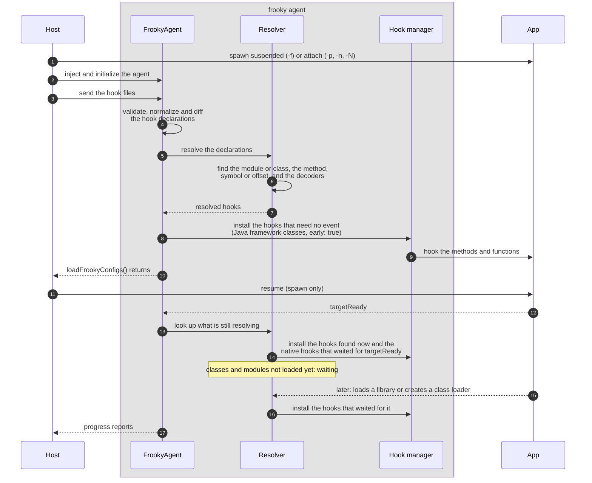
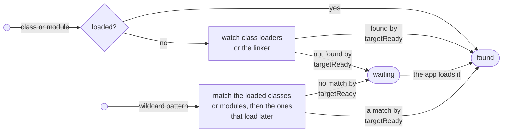
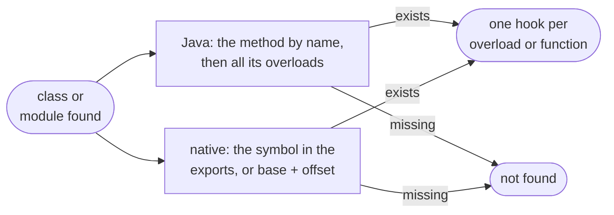
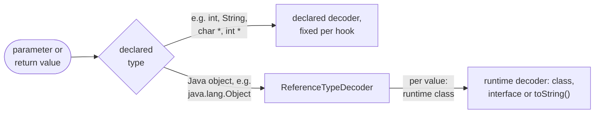
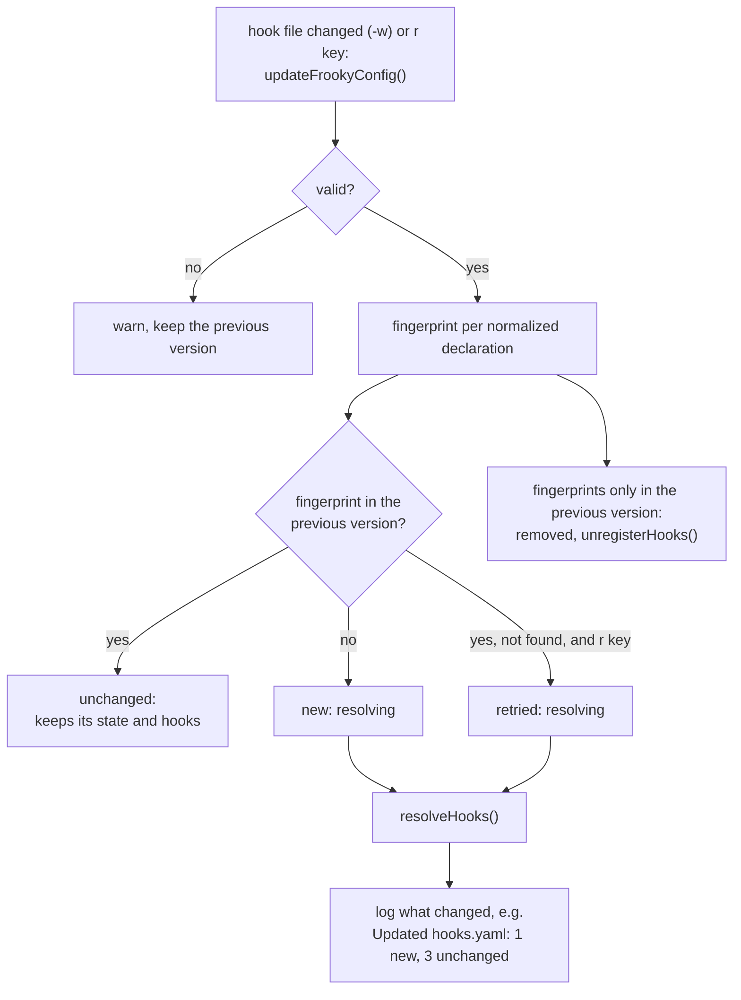
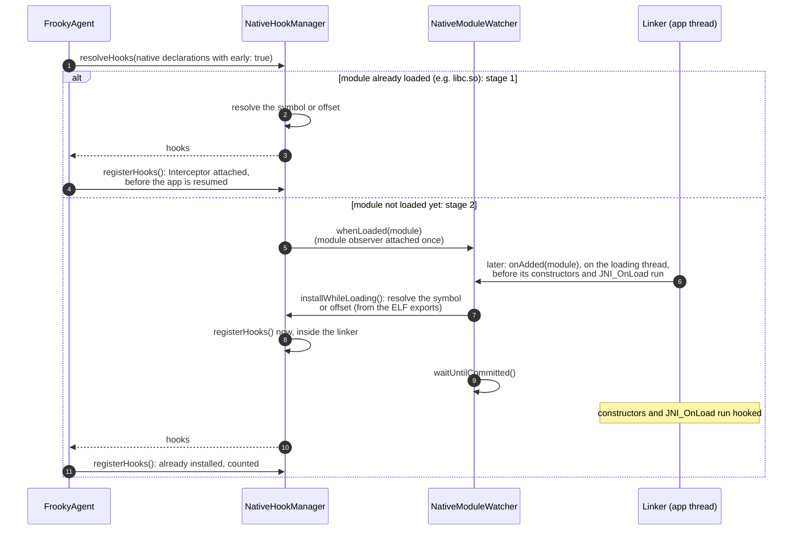
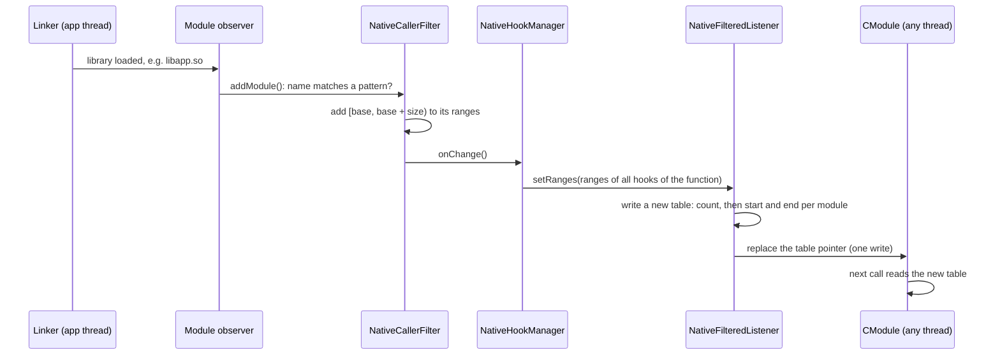
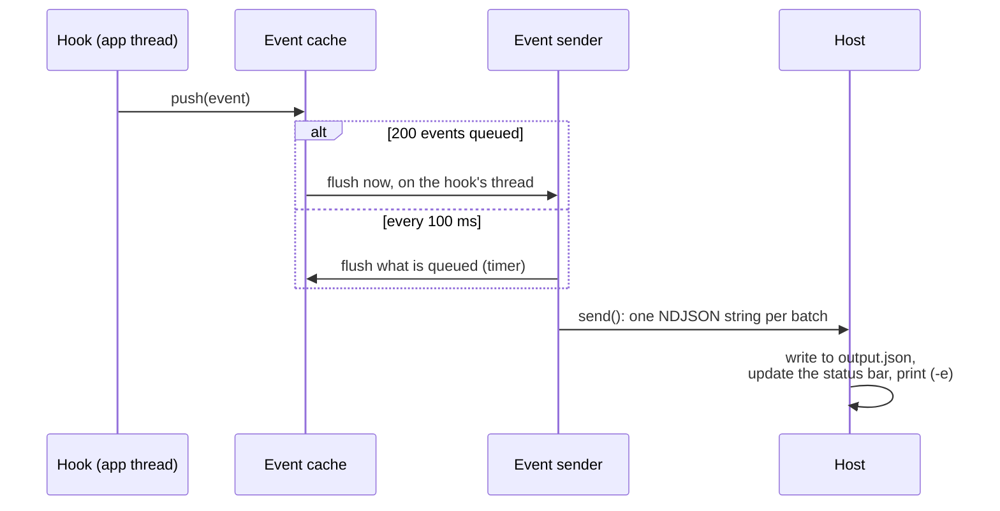

# Under the Hood

This page explains how frooky works internally: what happens to a hook from the hook file to the installed hook, when each kind of hook is installed, how a `callerFilter` decides which calls are recorded, and how events reach the host. It is optional reading for when you want to know why something behaves the way it does, e.g. why a hook shows up as `waiting`, why a call during startup was missed, or why a filtered hook still slows the app down. To learn how to use frooky, start with the [README](../README.md) and [Additional Features](./additional-features.md).

<!-- TOC -->

- [Overview](#overview)
- [Life of a Hook](#life-of-a-hook)
  - [Validation](#validation)
  - [Hook Initialization](#hook-initialization)
  - [Resolve the Module or Class](#resolve-the-module-or-class)
  - [Resolve the Symbol, Offset or Method](#resolve-the-symbol-offset-or-method)
  - [Resolve Declared or Runtime Decoders](#resolve-declared-or-runtime-decoders)
  - [Keeping Hooks Current](#keeping-hooks-current)
- [Timing](#timing)
  - [Stages](#stages)
  - [Safe Default: Wait for `targetReady`](#safe-default-wait-for-targetready)
  - [Danger Zone: Early Hooking](#danger-zone-early-hooking)
  - [Stack Traces During Early Hooking](#stack-traces-during-early-hooking)
- [Caller Filters](#caller-filters)
  - [The Path of a Native Call](#the-path-of-a-native-call)
  - [Which Listener a Function Gets](#which-listener-a-function-gets)
  - [Keeping the Module Ranges Current](#keeping-the-module-ranges-current)
  - [Caller Filters on Java Hooks](#caller-filters-on-java-hooks)
- [Danger Zone: Blocked Native Functions](#danger-zone-blocked-native-functions)
- [Danger Zone: Blocked Java Methods](#danger-zone-blocked-java-methods)
- [Collecting Events](#collecting-events)
  - [Capture an Event](#capture-an-event)
  - [Sending Event Batches to the Host](#sending-event-batches-to-the-host)
- [Crash Reporter](#crash-reporter)
- [User Scripts](#user-scripts)
- [JavaScript Runtimes](#javascript-runtimes)
- [Caching](#caching)

<!-- /TOC -->

## Overview

frooky has two parts:

- The **host** (Python) runs on your machine. It parses the command line, connects to the device, reads your hook files, writes `output.json` and shows the status bar.
- The **agent** (TypeScript) is injected into the app by Frida. It validates the hook files, finds the classes, methods and functions they declare, installs the hooks and decodes the values.

The diagram shows the simplified flow for a spawn. The **resolver** stands for everything that finds what a hook declaration names: the class or module, the method, symbol or offset in it, and the decoders for its values (steps 5 to 7), see [Life of a Hook](#life-of-a-hook). When attaching, the resume (step 11) is skipped and `targetReady` resolves right away.



The host starts the agent and hands it the hook files over Frida's RPC. Everything after that, from validating the hook files to installing the hooks, happens inside the app's process. The agent sends three kinds of messages back: batches of events, progress reports for the status bar, and crash reports (see [Sending Event Batches to the Host](#sending-event-batches-to-the-host)).

**`targetReady`** is the moment the app's own classes can be looked up, because the Android runtime has the app's class loader. It is a promise in `FrookyAgent`, resolved by a `Java.perform()` callback. When spawning, `Java.perform()` queues its callback until the app process binds its application: frida-java-bridge hooks `ActivityThread.handleBindApplication()` and runs the callback on the app's main thread, before the app's `Application` class is created. When attaching, the application already exists and `targetReady` resolves right away. Native hooks without `early: true`, the lookups in the app's class loaders and stack traces all wait for it.

**Sources:**

- [`runner.py`](../frooky/runner/runner.py) (attach or spawn, RPC calls, resume)
- [`index.frooky.ts`](../frooky/agent/src/android/index.frooky.ts) (RPC exports, `targetReady`)
- [`FrookyAgent.ts`](../frooky/agent/src/FrookyAgent.ts)
- [`messages.py`](../frooky/runner/messages.py) (agent messages on the host)

## Life of a Hook

The host passes all hook files at once to `loadFrookyConfigs` (step 3 of the [overview](#overview)). The RPC call returns once the hook files are parsed and every hook that needs no event, i.e. neither `targetReady` nor a class or module that loads later, is resolved and installed. In spawn mode, the host resumes the app right after (step 11), so these hooks are in place before any of the app's code runs. The other hooks keep resolving after the call has returned.

A **hook file** is one YAML file, which the host sends to the agent as a config, identified by its path. After normalization, each method (Java) or symbol or offset (native) in it is one **hook declaration**: diffs and [states](#hook-initialization) count declarations, and the hook statistics list each hooked method or function of a declaration. A declaration installs one **hook** per Java overload or native function. The **hook managers** resolve and install them: `AndroidHookManager` for Java hooks and `NativeHookManager` for native hooks.

Each hook file is processed on its own, all of them concurrently. Its hook declarations are validated and normalized, compared with the previously loaded version of the file (see [Keeping Hooks Current](#keeping-hooks-current)), and the new, changed and retried ones are resolved and installed.

**Source:**

- [`FrookyAgent.ts`](../frooky/agent/src/FrookyAgent.ts)

### Validation

```[mermaid]
flowchart LR
    yaml["Input YAML (hook file):<br/>InputFrookyConfig"]

    subgraph file["File validation and repair"]
        direction TB
        vcfg["validateAndRepairFrookyConfig()"] --> hasColl{"has hookCollection?"}
        hasColl -->|no| skip(["skip file with error"])
        hasColl -->|yes| vmeta["validate metadata<br/>(frookyMetadataSchema)"]
        vmeta --> vsettings["validate and repair settings:<br/>reset invalid settings to defaults,<br/>drop invalid callerFilter patterns"]
    end

    coll["for each hook collection:<br/>merge collection and file settings"]

    subgraph decl["Declaration validation and normalization"]
        direction TB
        vhook{"validate input hook<br/>(inputJavaHookSchema /<br/>inputNativeHookSchema)"}
        vhook -->|invalid| drop(["drop declaration with warning"])
        vhook -->|valid| norm["normalize hook declaration:<br/>• unpack shorthands (names, param tuples)<br/>• cascade merged settings to hook, params and retType<br/>• attach class or module scope"]
        norm --> sem{"semantic checks:<br/>• decoder args, config and names<br/>• drop blocked methods or functions<br/>• adjust early hooking on Java"}
        sem -->|rejected| drop
    end

    normHook(["Normalized internal types:<br/>JavaHookDeclaration / NativeHookDeclaration"])

    yaml --> file --> coll --> decl --> normHook
```

The hook-file format is described twice in TypeScript, once for the user and once for the code that processes it:

- **Input types** (the public interface, `Input*` in `frooky/agent/src/shared/inputParsing/`) describe what a hook file may contain. They are loose on purpose: most things can be written in several forms, e.g. a hook as just a method or symbol name or as an object, and settings can be left out. `npm run build:zodSchema` generates the Zod schemas in `zodSchemas/` from them, and `npm run build:jsonSchema` turns those into [`docs/schema/frooky-config.schema.json`](./schema/frooky-config.schema.json), which editors use to check and autocomplete hook files.
- **Normalized types** (`JavaHookDeclaration` and `NativeHookDeclaration` in `frooky/agent/src/shared/hook/hookDeclaration.ts`, with `Param` and `RetType`) are what the rest of the agent works with. They are not part of the schemas. Each normalized hook declaration is self-contained and always has the same shape: it carries its class or module, its fully merged `hookSettings` and `decoderSettings`, and each parameter and return value carries its own merged decoder settings. The hook managers, decoders and the diff in [Keeping Hooks Current](#keeping-hooks-current) never need to look at the collection or the file's settings, and never handle shorthands.

Normalization turns one into the other, e.g. this hook collection:

```yaml
- module: libcrypto.so
  decoderSettings:
    maxItems: 32
  hooks:
    - symbol: EVP_EncryptInit_ex
      params:
        - "EVP_CIPHER_CTX *"
        - ["const unsigned char *", key, { maxItems: 16 }]
```

Every parameter becomes a `Param` object with its `type`, its `name` if it has one, its `direction` and its complete decoder `settings`: the defaults, overridden by the file's settings, the collection's, the hook's and finally the parameter's own. The hook itself inherits its `module` and gets its complete settings:

```yaml
module: libcrypto.so
symbol: EVP_EncryptInit_ex
params:
  - { type: "EVP_CIPHER_CTX *", direction: in, settings: { maxDepth: 10, maxItems: 32 } }
  - { type: "const unsigned char *", name: key, direction: in, settings: { maxDepth: 10, maxItems: 16 } }
hookSettings: { maxStackFrames: 5, nativeStackTrace: false, platformStackTrace: false, callerFilter: [], early: false }
decoderSettings: { maxDepth: 10, maxItems: 32 }
```

Only the input is validated, against the Zod schemas generated from the input types. The normalized form is produced by frooky itself, and TypeScript guarantees its shape:

- `validateAndRepairFrookyConfig()` checks the file's `metadata` and `settings`. Invalid metadata and unknown properties only cause a warning. An invalid setting is reset to its default, also with a warning, and an invalid regular expression in `callerFilter` is dropped. The settings of a hook collection are repaired the same way. A file without a `hookCollection` is skipped; the other files still load.
- Each hook declaration is checked against its input schema (`inputJavaHookSchema` or `inputNativeHookSchema`) before it is normalized. An invalid declaration, including an invalid setting on the hook or one of its values, is dropped with a warning that names the invalid field; the other declarations of the file still load. A property the schema doesn't know, e.g. a misspelled `retTyp`, is ignored with a warning.

**Sources:**

- [`configValidator.ts`](../frooky/agent/src/shared/configValidator.ts)
- [`inputParsing/`](../frooky/agent/src/shared/inputParsing/)
- [`hookDeclaration.ts`](../frooky/agent/src/shared/hook/hookDeclaration.ts)
- [`androidHookValidator.ts`](../frooky/agent/src/android/hook/androidHookValidator.ts)
- [`nativeHookValidator.ts`](../frooky/agent/src/native/hook/nativeHookValidator.ts)

### Hook Initialization


Each normalized hook declaration is initialized on its own: frooky resolves its module or class, then the method, symbol or offset in it, then the decoders for its values, and then installs its hooks: Frida's Interceptor for a native function, a replaced implementation for a Java method.

A hook declaration is in one of these states, shown in the status bar and the [hook statistics](./additional-features.md#hook-statistics-s--s-key):

| State       | Meaning                                                                                                                                                                      |
| ----------- | ---------------------------------------------------------------------------------------------------------------------------------------------------------------------------- |
| `resolving` | frooky is resolving its module or class, its method, symbol or offset, or the decoders for its values.                                                                       |
| `waiting`   | Its module or class isn't loaded yet. frooky hooks the linkers and class loaders for these modules and classes. If they are loaded later, frooky will try to hook them then. |
| `installed` | The hook is installed and ready to be called.                                                                                                                                |
| `not found` | Its module or class is there, but the method, symbol or offset isn't. frooky doesn't look for it again.                                                                      |

**Source:**

- [`FrookyAgent.ts`](../frooky/agent/src/FrookyAgent.ts)

### Resolve the Module or Class



The Java and native declarations go to their hook managers concurrently. Each hook manager groups the declarations by their class or module and looks each one up once, no matter how many hooks target it. frooky doesn't poll for classes and modules, and doesn't wait a fixed time for them: a class or module that isn't loaded yet is found when the app loads it.

A **Java class**, e.g. `javax.crypto.Cipher` or `org.owasp.mastestapp.MainActivity`, is looked up by `JavaClassResolver.find()`:

1. In the default class loader with `Java.use()`. It has the Android framework's classes, also before the app runs, so a framework class is found right away.
2. Otherwise at `targetReady`, in every class loader the app has by then (`Java.enumerateClassLoadersSync()`), e.g. the `PathClassLoader` with the app's own classes.
3. Otherwise the declaration is `waiting`. Since step 1 missed, frooky watches the constructors of `BaseDexClassLoader` and its subclasses, which every class loader that reads dex files runs, and looks the class up in each new class loader while it is created, before any of its classes are used. This also catches class loaders created before `targetReady`.

With `classLoader`, the class is only looked up in instances of that class loader class: frooky hooks its `loadClass(String)`, or the one it inherits, and checks each class it returns, before the app gets it.

A **native module**, e.g. `libc.so` or `libnative-lib.so`, is looked up by `NativeHookManager`:

1. In the loaded modules with `Process.findModuleByName()`. The system libraries, e.g. `libc.so`, are found right away.
2. Otherwise `NativeModuleWatcher` attaches a module observer (`Process.attachModuleObserver()`, once) and waits for a module with this name or path (`whenLoaded()`). Its `onAdded` callback runs on the thread that loads the module, inside the linker, before the module's constructors and `JNI_OnLoad` run.
3. At `targetReady`, frooky doesn't look again, it only checks whether the observer has seen the module. If not, the declaration is `waiting` until it loads.

A **wildcard pattern**, e.g. `org.owasp.*.HttpClient` or `libssl*.so`, can match several classes or modules:

- **Java:** at `targetReady`, `matchPatterns()` matches it against the loaded classes and the class names in the dex files of every class loader, on a timer rather than the app's main thread, as it reads every class name of the app. Without a match, it matches the dex files of each new class loader while it is created, until one has matching classes. Classes that match after that aren't hooked.
- **Native:** `resolveModulePatterns()` matches it against the loaded modules (`Process.enumerateModules()`), then `NativeModuleWatcher.whenEachLoaded()` against each module the linker loads, while it loads, for the rest of the session. The hooks of later matches are added to the same declaration. The exports of each module are read once for all patterns.

A pattern without a match by `targetReady` is `waiting` until its first match.

As soon as the class or module is found, frooky resolves the [method, symbol or offset](#resolve-the-symbol-offset-or-method) in it, in the same callback: for a class loader or module that loads later, on the app's thread, before the app runs its code.

**Sources:**

- [`androidHookManager.ts`](../frooky/agent/src/android/hook/androidHookManager.ts) (`resolveHooks()`)
- [`javaClassResolver.ts`](../frooky/agent/src/android/hook/javaClassResolver.ts) (`find()`, `matchPatterns()`)
- [`nativeHookManager.ts`](../frooky/agent/src/native/hook/nativeHookManager.ts) (`resolveHooks()`, `resolveModulePatterns()`)
- [`nativeModuleWatcher.ts`](../frooky/agent/src/native/nativeModuleWatcher.ts) (`whenLoaded()`, `whenEachLoaded()`)

### Resolve the Symbol, Offset or Method



The method, symbol or offset is resolved as soon as its class or module is found. That's also true for a native hook that is then only installed at `targetReady`, so a misspelled name fails right away.

A **Java method** is resolved by `resolveMethodHooks()`:

1. It looks up the method by name on the class (`javaClass[method]`). frida-java-bridge returns a method dispatcher with all overloads of that name.
2. Without `overloads`, every overload is hooked, each as its own hook. Its parameters are built from the overload's argument types, e.g. `[B`, `int` or `java.lang.String`, each with the declaration's `decoderSettings`. The return type comes from the overload as well. So a Java hook needs no `params` or `retType` in the hook file.
3. With `overloads`, only the declared ones are hooked (`method.overload(...types)`), with the parameters of the hook file. A declared overload that doesn't exist is skipped with a warning.

A **native function** is resolved by `resolveNativeHook()`:

1. A `symbol` is looked up by `resolveSymbol()` in the module's exported (dynamic) symbols: with `findExportByName()` in a loaded module, and from the module's ELF exports (`enumerateExports()`, read once per module) in a module that is loading, as `getExportByName()` makes the linker abort the process while it loads the module. `findExportByName()` searches like `dlsym()`, so it also finds the functions of the libraries the module links, e.g. libc's `malloc` from `libcutils.so`. An address outside the module is skipped with a warning that names the library that defines the function (see [Functions From Other Libraries](./native-hook-declaration.md#functions-from-other-libraries)), so a hook resolves the same in a loaded module and in one that is loading.
2. An `offset` is resolved by `resolveModuleOffset()` as `module.base + offset`. frooky only hooks the address if it is inside the module and executable, and, if Frida finds a section at that address, if the section's name starts with `.text`, `.plt`, `.init` or `.fini`. Otherwise it skips the hook with a warning, e.g. for an offset from another build of the library, which can point into data: the Interceptor would overwrite that data and crash the app.

A method, symbol or offset that doesn't resolve, or a declaration whose `overloads` all don't exist, is logged as a warning, and the declaration is `not found`.

**Sources:**

- [`javaMethodResolver.ts`](../frooky/agent/src/android/hook/javaMethodResolver.ts) (`resolveMethodHooks()`, `resolveOverloads()`)
- [`nativeAddressResolver.ts`](../frooky/agent/src/native/hook/nativeAddressResolver.ts) (`resolveNativeHook()`, `resolveSymbol()`, `resolveModuleOffset()`)

### Resolve Declared or Runtime Decoders



Decoders are resolved when a hook is installed (`prepareHook()`, called by `registerHooks()`), once per hook and not per call: one decoder for each parameter and one for the return value. `JavaDecoderResolver` and `NativeDecoderResolver` pick each one from the value's declared type and its merged decoder settings.

By default, without `decoder:`, the declared type decides. A **declared decoder** is fixed from then on. A **runtime decoder** is picked for each value while the hook runs, by the class of the object the app actually passes.

A **Java value** gets a declared decoder by its declared type, i.e. the type of the overload's parameter or return value:

| Declared type                             | Decoder                | Output                                                                                            |
| ----------------------------------------- | ---------------------- | ------------------------------------------------------------------------------------------------- |
| A primitive, `void` or `java.lang.String` | `PrimitiveDecoder`     | The JSON value; a `long` is a decimal string to keep its 64-bit precision                         |
| An array, e.g. `[B` (`byte[]`)            | `ArrayDecoder`         | The elements, up to `maxItems`                                                                    |
| Any other class, e.g. `java.lang.Object`  | `ReferenceTypeDecoder` | Decoded by the runtime decoder of the object's class, see below                                   |
| An interface, e.g. `java.util.Map`        | `ReferenceTypeDecoder` | Decoded by the runtime decoder of the object's class, e.g. `MapDecoder` for a `java.util.HashMap` |

`ReferenceTypeDecoder` picks the decoder based on the runtime class when it decodes a value that isn't `null`, e.g. `java.util.HashMap` for a parameter declared as `java.util.Map`. The choice is cached by the class name (`$className`). On a cache miss, it gets the class with `getClass()` and takes the first of:

1. The class decoder of the runtime class or of its nearest superclass with one, e.g. `IntentDecoder` for `android.content.Intent`, or `X509CertificateDecoder` and not `CertificateDecoder` for an X.509 certificate.
2. The decoder of the most specific interface the class implements, e.g. `MapDecoder` for `java.util.HashMap`. If it implements several unrelated interfaces with a decoder, the order of the registry decides and frooky logs a warning.
3. `toString()`, with `StringDecoder`.

A **native value** only has its declared decoder: a native value is just a number or an address, with no runtime type to look at. Its declared type is the `type` in the hook file, which `parseNativeFridaType()` maps to a Frida type: it drops `const` and `volatile`, reads an array (`char *[]`) as a pointer, and knows the C and JNI names of the fundamental types, e.g. `uint8_t`, `long long` or `jint`.

| Declared type                                                   | Decoder                  | Output                                                                                             |
| --------------------------------------------------------------- | ------------------------ | -------------------------------------------------------------------------------------------------- |
| A fundamental type, e.g. `int`, `size_t` or `jint`              | `NativeValueDecoder`     | The value; a 64-bit value is a decimal string                                                      |
| A pointer to a fundamental type, e.g. `char *` or `int *`       | `NativeReferenceDecoder` | The value it points to: a string for `char *`, the number for `int *`, the address for `void *`    |
| A pointer to UTF-16 units, e.g. `const jchar *` or `char16_t *` | `NativeUtf16Decoder`     | The string                                                                                         |
| Anything else, e.g. `FILE *`, `struct stat *` or `pid_t`        | `NativeFallbackDecoder`  | The raw value in hex, e.g. `0x7b2c4a1f00`: the address for a pointer, the value itself for `pid_t` |

`NativeDecoderResolver` checks for UTF-16 first: `jchar` is also a fundamental type (`uint16`), so `const jchar *` would otherwise be read as a pointer to one number.

**Sources:**

- [`hookManager.ts`](../frooky/agent/src/shared/hook/hookManager.ts) (`resolveParamDecoders()`)
- [`javaDecoderResolver.ts`](../frooky/agent/src/android/decoders/javaDecoderResolver.ts)
- [`ReferenceTypeDecoder.ts`](../frooky/agent/src/android/decoders/builtin/ReferenceTypeDecoder.ts)
- [`androidHookManager.ts`](../frooky/agent/src/android/hook/androidHookManager.ts) (`prepareHook()`)
- [`nativeHookManager.ts`](../frooky/agent/src/native/hook/nativeHookManager.ts) (`prepareHook()`)
- [`nativeDecoderResolver.ts`](../frooky/agent/src/native/decoders/nativeDecoderResolver.ts)
- [`nativeFridaType.ts`](../frooky/agent/src/native/decoders/nativeFridaType.ts) (`parseNativeFridaType()`)

### Keeping Hooks Current

Every normalized declaration gets a fingerprint. On a [reload](./additional-features.md#interacting-with-frooky), unchanged declarations keep their installed hooks, removed ones are unhooked, and only new, changed or retried ones are resolved. On the first load, every declaration is new and starts in the state `resolving`.



A changed declaration has a new fingerprint, so it is removed and added again: its old hooks are unhooked and its new version is resolved and installed. The summary counts such a pair with the same target (method or symbol) as `updated`.

**Sources:**

- [`FrookyAgent.ts`](../frooky/agent/src/FrookyAgent.ts) (diff)
- [`watcher.py`](../frooky/runner/watcher.py) (watch mode)
- [`runner.py`](../frooky/runner/runner.py) (`r` key)

## Timing

When a hook is installed decides which calls it can record: a call made before its hook is installed is missed.

### Stages

A spawned app goes through three stages:

1. **Paused at spawn:** Frida has started the process suspended. The agent loads the hook files, and none of the app's code runs.
2. **Resumed:** the host has resumed the app and the process starts up, but `targetReady` hasn't resolved yet. The linker can already load libraries.
3. **`targetReady`:** the app's class loader exists and the app's own code is about to run. From here on, the app runs normally.

When attaching, the app is already in stage 3. What can be hooked in each stage:

| Stage                  | Native hooks                                                                                          | Java hooks                                                          | Stack traces                                       |
| ---------------------- | ----------------------------------------------------------------------------------------------------- | ------------------------------------------------------------------- | -------------------------------------------------- |
| **1. Paused at spawn** | ⚠️ Only with `early: true`, on modules that are already loaded (e.g. `libc.so`)                       | ✅ Classes of the default class loader (e.g. `javax.crypto.Cipher`) | ⚠️ No Java frames in native hooks (`before-ready`) |
| **2. Resumed**         | ⚠️ Only with `early: true`, in the linker while a module loads, before `.init_array` and `JNI_OnLoad` | ⏳ App classes stay `resolving`                                     | ⚠️ No Java frames in native hooks (`before-ready`) |
| **3. `targetReady`**   | ✅ Every waiting hook on a loaded module is installed                                                 | ✅ App classes are looked up in the app's class loaders             | ✅ Java and native                                 |

Stack traces are off by default: a hook only captures them with `nativeStackTrace: true` or `platformStackTrace: true` (Java frames). In every stage, frooky skips the stack trace of a call it detects as unsafe, see [Stack Traces During Early Hooking](#stack-traces-during-early-hooking).

### Safe Default: Wait for `targetReady`

Native hooks wait for `targetReady` by default, as hooks during startup can deadlock the app, see [Danger Zone: Early Hooking](#danger-zone-early-hooking).

A native hook without `early: true` is resolved as soon as its module is found, and installed once both its module is found and `targetReady` has resolved, whichever comes later:

| Module loaded in                                            | Resolved                                           | Installed                                                                                             |
| ----------------------------------------------------------- | -------------------------------------------------- | ----------------------------------------------------------------------------------------------------- |
| **1. Paused at spawn**, i.e. already loaded, e.g. `libc.so` | 1. Paused at spawn, right away                     | 3. `targetReady`                                                                                      |
| **2. Resumed**                                              | 2. Resumed, inside the linker while it loads       | 3. `targetReady`; the module's constructors and `JNI_OnLoad` run unhooked                             |
| **3. `targetReady`**                                        | 3. `targetReady`, inside the linker while it loads | 3. `targetReady`, right then inside the linker, before the module's constructors and `JNI_OnLoad` run |

When attaching, the app is already in stage 3, so every native hook is installed as soon as its module is found.

Java hooks don't wait: a class of the default class loader is hooked in stage 1, an app class in stage 3 at `targetReady`, or already in stage 2 while a new class loader that has it is created.

**Source:**

- [`nativeHookManager.ts`](../frooky/agent/src/native/hook/nativeHookManager.ts) (`resolveInLoadedModule()`, `installWhileLoading()`)

### Danger Zone: Early Hooking

Before `targetReady`, the runtime (ART) is still starting its own threads, and hooks on functions like `read` or `close` collide with them: the app can deadlock or stop responding (ANR).



`early: true` skips the wait for `targetReady` (see [Early Hooking](./additional-features.md#early-hooking) for when to use it). When attaching, the app is already past `targetReady`, so `early` changes nothing.

A hook is installed as soon as its module is found: before the app is resumed (stage 1) if the module is already loaded, otherwise inside the linker while the module loads (stage 2), so its constructors and `JNI_OnLoad` run hooked.

Stage 2 relies on Frida's module observer (`Process.attachModuleObserver()`), which calls back on the loading thread for every module the linker loads. frooky uses it like this:

- `NativeModuleWatcher` attaches one observer when the first hook waits for a module (`observeModules()`) and keeps it for the rest of the session.
- Each waiting hook is registered under the module name (or path) it declares (`whenLoaded()`). When a module with that name or path loads, the callback removes the waiting hooks and calls them.
- They resolve the symbol or offset and, with `early: true` or after `targetReady`, install the hooks right there (`installWhileLoading()`).
- Before the callback returns, it waits until Frida has committed the new hooks (`waitUntilCommitted()`). Frida commits Interceptor changes only once no other thread is in a hook callback, of frooky or of a `-l` script. Otherwise a thread that entered one at that moment would delay the commit until after the module's constructors ran, and their calls would be missed. The callback gives up the JS lock in 1ms steps until the hooked functions' code is patched, for up to 1s, and logs a warning if that isn't enough. The loading thread holds the linker's lock meanwhile, so other threads' hooks use only the fuzzy backtracer (`linker-busy`), which doesn't need it.
- Calls that the new hooks record on this thread until `dlopen()` returns, e.g. from the module's constructors, get full stack traces: the thread holds the linker's lock itself. Other threads' hooks get only fuzzy native frames meanwhile (`linker-busy`), see [Stack Traces During Early Hooking](#stack-traces-during-early-hooking).

`NativeCallerFilter` attaches a second observer of its own, which keeps the address ranges of the caller filters current, see [Keeping the Module Ranges Current](#keeping-the-module-ranges-current).

The validator warns about an `early: true` hook on a high-frequency libc function (e.g. `read`, `close`, `malloc`) without a `callerFilter`, which can deadlock the app or make it stop responding (ANR) during startup.

**Sources:**

- [`nativeHookManager.ts`](../frooky/agent/src/native/hook/nativeHookManager.ts) (`early`, `installWhileLoading()`)
- [`nativeModuleWatcher.ts`](../frooky/agent/src/native/nativeModuleWatcher.ts) (`observeModules()`, `whenLoaded()`, `waitUntilCommitted()`)
- [`nativeHookValidator.ts`](../frooky/agent/src/native/hook/nativeHookValidator.ts) (`warnOnHighFrequencyLibcHook()`)
- [`Process.attachModuleObserver()`](https://frida.re/docs/javascript-api/#process) (Frida's module observer)

### Stack Traces During Early Hooking

A stack walk runs on the app's thread and stack, inside the hooked call. In some calls it can crash or hang the app, e.g. while another thread holds the linker's lock. Instead of capturing no stack traces at all until `targetReady`, frooky checks every call that needs one and only leaves out the frames whose walk is unsafe in that call. So hooks with `early: true` can record stack traces during startup.

`detectUnsafeContext()` runs once per call, if a hook needs a stack trace, or for a Java hook a `callerFilter`. On a native hook, it only runs once the call has passed the hook's [caller filter](#caller-filters). It returns the first of these reasons, or none:

| Reason         | How frooky detects it, and why it matters                                                                                                                                                                                                                                                                                     | Native frames         | Java frames                                                     |
| -------------- | ----------------------------------------------------------------------------------------------------------------------------------------------------------------------------------------------------------------------------------------------------------------------------------------------------------------------------- | --------------------- | --------------------------------------------------------------- |
| `signal-stack` | `sigaltstack()` reports that the thread runs on its alternate signal stack, or the call's stack pointer is inside it. These stacks are small, usually 32KB, and symbolizing the frames or a Java walk can overflow them.                                                                                                      | none                  | none                                                            |
| `linker-busy`  | Another thread is inside `dlopen()` or `dlclose()`, and this one isn't. That thread can hold the linker's lock while it waits for the agent in a hook, e.g. in a library constructor or frooky's module observer. The accurate backtracer needs the lock (`dl_iterate_phdr()`) for return addresses it hasn't unwound before. | fuzzy backtracer only | yes, once `Java.backtrace()` is initialized                     |
| `low-stack`    | Less than 64KB are left between the call's stack pointer and the lowest usable address of the thread's stack. Native hooks only, as Java hooks have no CPU context.                                                                                                                                                           | none                  | none                                                            |
| `before-ready` | `targetReady` hasn't resolved yet. A native hook can fire on a thread that is still attaching to the Java VM: `Java.vm.tryGetEnv()` already returns its `JNIEnv`, but walking its Java stack crashes the app.                                                                                                                 | yes                   | in Java hooks, whose thread runs Java code; not in native hooks |

A thread that is inside `dlopen()` or `dlclose()` itself, e.g. in a library constructor, is no reason: it holds the linker's lock, which is recursive, so its own stack walks don't wait for it. `JNI_OnLoad` doesn't run inside the linker at all, ART calls it after `dlopen()` has returned. The linker never calls libc's functions while it loads a module, it has its own copies of e.g. `mmap` and `openat`, so the agent's code only runs inside the linker in library constructors and destructors, the functions they call, and Frida's module observer.

How the stack traces are captured, and how the checks stay cheap:

- **Native frames:** only native hooks have them, as Java hooks have no CPU context. frooky calls `Thread.backtrace()` with Frida's accurate backtracer (`Backtracer.ACCURATE`), which follows the unwind information and stops after `maxStackFrames`. Only if that returns no frame at all, e.g. for code without unwind information, does it fall back to the fuzzy backtracer (`Backtracer.FUZZY`), which scans the stack for values that look like return addresses and can include some that aren't. At `linker-busy`, it uses the fuzzy backtracer right away, which doesn't need the linker's lock. Symbolizing the frames (`DebugSymbol.fromAddress()`) reads the modules' ELF files and doesn't need it either.
- **Java frames:** `Java.backtrace()` walks ART's managed stack; it has no backtracer option. Its first call builds a module, which needs the linker's lock and gives up the agent's lock meanwhile. frooky makes that call at `targetReady` on the agent's own thread (`PlatformStackTrace.prepare()`), so later walks need neither.
- **Linker watch:** when the agent starts, before any hook is installed, `watchLinker()` hooks the linker's entry points `__loader_dlopen`, `__loader_android_dlopen_ext` and `__loader_dlclose` and counts the threads inside them. These entry points run before the linker takes its lock, so their callbacks never wait for the agent while holding it.
- **Stack bounds:** `pthread_getattr_np()` is called once per thread, and its result is cached by thread ID. It counts the guard pages below a thread's stack as stack, e.g. 20KB on Android 15 x86_64, so frooky moves the lower bound above them. A stack pointer outside the cached bounds, e.g. of a new thread with a reused ID, looks the bounds up again.

The event's `stackTrace` gets a `skipped` field with the reason when requested frames are missing, see [Skipped Stack Traces](./additional-features.md#skipped-stack-traces). A Java hook's `callerFilter` walks the Java stack, so it drops the call when that walk is left out, e.g. at `linker-busy` while `Java.backtrace()` isn't initialized yet. A native hook's `callerFilter` reads only the return address and is checked in every call. The validator notes (with `-v`) that a native hook with `early: true` and `platformStackTrace: true` gets no Java frames before `targetReady`. See [`03_stack_traces_while_loading.yaml`](./examples/native/08_early_hooking/03_stack_traces_while_loading.yaml) for the stack traces of a library's constructor and `JNI_OnLoad`.

These checks cover the known ways a stack walk crashes or hangs the app, not every one. That's why the validator still warns about stack traces on high-frequency libc functions, and why stack traces of `sigprocmask` are [blocked](#danger-zone-blocked-native-functions). A Java hook gets no stack check, as frooky can't prevent the crash: near the end of a thread's stack, e.g. deep in a recursion, ART throws a `StackOverflowError` while frida-java-bridge enters or leaves the hook, before or after frooky's code runs. On an Android 15 x86_64 emulator, a hooked method crashed the app with up to 35KB of stack left, also when the hook only called the original method, and the same call without a hook didn't crash with 11KB left.

**Sources:**

- [`unsafeContext.ts`](../frooky/agent/src/native/unsafeContext.ts) (`detectUnsafeContext()`, `watchLinker()`)
- [`androidStackTrace.ts`](../frooky/agent/src/android/androidStackTrace.ts)
- [`nativeStackTrace.ts`](../frooky/agent/src/native/nativeStackTrace.ts)

## Caller Filters

A high-frequency function, e.g. `malloc`, is called mostly by code you aren't interested in: ART, the framework, system libraries and SDKs. A `callerFilter` drops these calls before frooky decodes any value, builds a stack trace or creates an event. A native hook's filter needs no stack walk, so it is also checked in the calls in which stack traces are skipped, e.g. on an alternate signal stack (`signal-stack`) or near the end of a thread's stack (`low-stack`).

`callerFilter` is a list of regular expressions, compiled once per hook (`new RegExp(pattern)`, not anchored). What the expressions are matched against depends on the hook:

- **Native hooks:** the names of the loaded modules. frooky turns the matching modules into address ranges and compares the return address of each call with them: the address `bl` stores in the link register on arm64, or `call` pushes onto the stack on x86_64, read when the function is entered, see [Keeping the Module Ranges Current](#keeping-the-module-ranges-current).
- **Java hooks:** each frame of the Java stack as `<class>.<method>`, see [Caller Filters on Java Hooks](#caller-filters-on-java-hooks).

See [Caller Filters](./additional-features.md#caller-filters) for how to write them, examples and pitfalls.

**Sources:**

- [`nativeCallerFilter.ts`](../frooky/agent/src/native/nativeCallerFilter.ts) (native `callerFilter` and its ranges)
- [`nativeFilteredListener.ts`](../frooky/agent/src/native/hook/nativeFilteredListener.ts) (`callerFilter` in native code)
- [`androidStackTrace.ts`](../frooky/agent/src/android/androidStackTrace.ts) (Java `callerFilter`)
- [`platformStackTrace.ts`](../frooky/agent/src/shared/platformStackTrace.ts) (`compileCallerFilter()`)

### The Path of a Native Call

frooky attaches one Frida Interceptor listener per hooked function, no matter how many hooks and hook files declare it. That listener is one of two kinds:

- A **`NativeFilteredListener`**: a small CModule (C code that Frida compiles in the app's process) checks the return address and only calls into JavaScript for calls from a matching module.
- The **JS listener**: Frida enters the JavaScript engine for every call, and the filter is the first thing that runs there.


A function can have several hooks, e.g. from two hook files, with different filters. The listener lets a call through if any hook's filter matches it. `enterHooks()` then checks each hook's own `callerFilter` again, so each hook records only its own calls.

Between `onEnter` and `onLeave`, the JS listener keeps a call's state on Frida's invocation context (`this`). The `NativeFilteredListener` stores a call ID in the Interceptor's per-call data instead, and JavaScript keeps the state in a map by that ID. A call with an ID of 0 never calls into JavaScript on leave.

### Which Listener a Function Gets

A call that the `NativeFilteredListener` passes on reaches JavaScript through a `NativeCallback`, not through the Interceptor. Inside it, `this.context` is the callback's own frame, not the hooked call's: the CPU registers of the call are gone. So a function only gets a `NativeFilteredListener` if none of its hooks needs them:

| All hooks of the function...            | Why                                                                                                 |
| --------------------------------------- | --------------------------------------------------------------------------------------------------- |
| have a `callerFilter`                   | a hook without one records every call, which has to enter JavaScript anyway                         |
| don't record native stack traces        | the stack walk starts at the call's registers; from the callback, Frida's own frames are in the way |
| don't decode `float` or `double` values | on x86_64 and arm64 they are in the FP registers, which are part of the CPU context                 |
| have at most 16 params                  | the CModule passes up to 16 arguments on                                                            |

Java stack traces (`platformStackTrace`), `argFilter`, `out` params, `errno` and the [checks for unsafe calls](#stack-traces-during-early-hooking) work on both listeners. For the stack checks, the CModule passes an address on the calling thread's stack.

When hooks are added or removed, frooky checks the rules again and swaps the listener if needed, e.g. to the JS listener while a second hook file adds a hook with `nativeStackTrace: true` to the same function, and back once it's removed. With `-vv`, frooky logs which listener a function got and why:

```text
DEBUG  Caller filter on libc.so!malloc: checked in JS, as a hook records native stack traces
DEBUG  Caller filter on libc.so!free: checked in native code
```

If the CModule can't be compiled, every function falls back to the JS listener. The hook statistics (`s` key) count the calls dropped by either listener in the `Filtered` column.

### Keeping the Module Ranges Current

A native `callerFilter` matches module names, but the listener compares addresses. Each filter keeps the address ranges of the loaded modules whose names match, and updates them when a module is loaded or unloaded:



Threads in the CModule read the table without a lock. `setRanges()` therefore never changes a table: it writes a new one and then replaces the pointer, so a thread sees either the old or the new table. The old tables stay allocated, as a thread may still be reading one. Before a matching module is loaded, the table is empty and every call is dropped.

### Caller Filters on Java Hooks

A Java hook has no native listener: frooky replaces the method's implementation with a JavaScript function, so every call enters JavaScript. The dispatcher passes the call to `PlatformStackTrace.build()` with `filterCallers`, which walks the Java stack with `Java.backtrace()` and matches each frame except the hooked method itself on top. If no frame matches, the call is dropped: it still runs the original method, without decoding or an event.

The walk needs the Java VM, so the filter can't be checked before `targetReady`, on a thread that isn't attached to the VM, or in an [unsafe context](#stack-traces-during-early-hooking), and these calls are dropped. frida-java-bridge builds its backtrace code on the first `Java.backtrace()` and isn't safe if two threads do it at once, so while the first call builds it, other threads get an empty Java stack and their calls are dropped too.

## Danger Zone: Blocked Native Functions

Most risky hooks only need care, e.g. a `callerFilter` or no stack traces, and the validator warns about them. A few functions break the app however they are hooked, because Frida, the JavaScript engine or the stack walker depend on them themselves, or because hooking changes what they do. A warning wouldn't help there, so frooky drops hooks on these functions (or, for `sigprocmask`, their stack traces) while it [validates the hook file](#validation) and logs a warning instead:

| Function                                          | Why                                                                                                                                                                                                                         |
| ------------------------------------------------- | --------------------------------------------------------------------------------------------------------------------------------------------------------------------------------------------------------------------------- |
| `pthread_getspecific`, `pthread_setspecific`      | Frida's Interceptor uses them itself: installing the hook hangs the app.                                                                                                                                                    |
| `dlopen` (`libdl.so`)                             | The linker picks the namespace by the caller's address, which the hook changes, so system libraries (e.g. graphics drivers) fail to load.                                                                                   |
| `memset`, `clock_gettime` under V8                | V8 calls them itself while it runs a hook, which re-enters V8 and crashes the app (`SIGTRAP`).                                                                                                                              |
| `sigprocmask` (stack traces)                      | Its calls come from ART's signal chain wrapper in `libsigchain.so`, and Frida's accurate stack walker crashes the app (`SIGSEGV`) when it walks from there, also after `targetReady`. A `callerFilter` needs no stack walk. |
| `mmap` with `early: true` under V8 (stack traces) | Before `targetReady`, a stack trace in it stops the app's start-up: `targetReady` never resolves.                                                                                                                           |

`findBlockedFunction()` matches the symbol and the module, ignoring case: its name, its name without `.so`, or a path that ends in it. The V8 entries only match under V8 (`Script.runtime`), the `mmap` entry only with `early: true`. See [Blocked Functions](./additional-features.md#blocked-functions) for the list with alternatives.

**Source:**

- [`nativeHookValidator.ts`](../frooky/agent/src/native/hook/nativeHookValidator.ts) (`BLOCKED_FUNCTIONS`, `findBlockedFunction()`)

## Danger Zone: Blocked Java Methods

A few Java methods break the app however they are hooked, also with a plain Frida script that only calls the original method. Most of them look up their caller on the stack: frida-java-bridge calls the original method from its replacement of it, whose class is the hooked method's own class. These methods then see a boot class as their caller instead of the app's class. frooky drops hooks on them while it [validates the hook file](#validation), and logs a warning instead:

| Method                                                | Why                                                                                                                                                                                                 |
| ----------------------------------------------------- | --------------------------------------------------------------------------------------------------------------------------------------------------------------------------------------------------- |
| `java.lang.String.$init`                              | ART runs each `String` constructor as a `java.lang.StringFactory` method, so the hook never runs. On Android 12, ART finds no `StringFactory` method for the hooked constructor and aborts the app. |
| `java.lang.Class.forName(String)`                     | It loads the class with its caller's class loader, which becomes the boot class loader: the app's classes aren't found (`ClassNotFoundException`).                                                  |
| `java.lang.System.loadLibrary`                        | It loads the library with its caller's class loader, which becomes the boot class loader: the app's libraries aren't found (`UnsatisfiedLinkError`).                                                |
| `newUpdater` of the `Atomic*FieldUpdater` classes     | It checks its caller's access to the field, and the caller becomes the updater class: it throws `IllegalAccessException` on private fields, e.g. those of Kotlin coroutines.                        |
| `VMStack.getStackClass2`, `Reflection.getCallerClass` | The hook adds a frame, so they return the wrong caller and e.g. `Class.forName()` doesn't find the app's classes. On Android 15, `getCallerClass` didn't break the app.                             |

The method is matched by the exact class name and, for `forName`, by the parameter types. Declared `overloads` are filtered while the hook file is validated; a hook on every overload skips the blocked ones when the class is resolved (`resolveOverloads()`). Measured on Android 12 and 15 (x86_64). See [Blocked Functions](./additional-features.md#blocked-functions) for the list with alternatives.

**Source:**

- [`androidHookValidator.ts`](../frooky/agent/src/android/hook/androidHookValidator.ts) (`BLOCKED_METHODS`, `findBlockedMethod()`)
- [`javaMethodResolver.ts`](../frooky/agent/src/android/hook/javaMethodResolver.ts) (blocked overloads of a hook on every overload)

## Collecting Events

Hooks run on the app's threads, so recording a call must not wait for the host. A hook only decodes the call's values into a plain JavaScript object and adds it to a queue in the agent. Sending happens in batches, separately from the calls.

### Capture an Event

A recorded call goes through the same steps on both platforms. Only the hooks that pass their filters get to the next step:

1. **Re-entry guard:** `enterHookCode()` marks the thread as running hook code. A hooked function or method that frooky's own code calls on this thread, e.g. `toString()` while decoding a Java object or `readlink` in `decoder: fd`, runs without its hooks, which would otherwise recurse until the stack overflows. Java and native hooks share the guard.
2. **On enter:** the `callerFilter`, the `in` and `inout` arguments, decoded and checked against their `argFilter`, and the stack trace if the hook needs one, after checking for an [unsafe context](#stack-traces-during-early-hooking). A native hook decodes before it builds the stack trace. A Java hook builds the stack trace first, as its `callerFilter` walks the Java stack. For `out` arguments, the native hook copies the argument pointers, as Frida's arguments are only valid in `onEnter`. `float` and `double` arguments are read from the FP registers.
3. **The original runs:** a native function returns to the Interceptor. A Java dispatcher calls the original method once for all hooks of the overload.
4. **On leave:** the return value is decoded first, as an `out` argument with `decoderArgs: { length: $ret }` needs it, then the `out` and `inout` arguments, again checked against their `argFilter`. `errno` is read right after the call, before frooky's code can change it.
5. **Event:** `addEventToLog()` creates the event (`NativeHookEvent` or `JavaHookEvent`) with the decoded values and the stack trace, pushes it to the event cache, and counts it and its decoding time for the [hook statistics](./additional-features.md#hook-statistics-s--s-key).

A failing decoder drops the call with an error log, but never the app's call: the original function or method still runs and returns its value.

**Sources:**

- [`nativeHookManager.ts`](../frooky/agent/src/native/hook/nativeHookManager.ts) (`enterHook()`, `leaveHook()`)
- [`androidHookManager.ts`](../frooky/agent/src/android/hook/androidHookManager.ts) (`createDispatcher()`)
- [`hookManager.ts`](../frooky/agent/src/shared/hook/hookManager.ts) (`decodeArgs()`, `argFilter`)
- [`nativeFloatArgs.ts`](../frooky/agent/src/native/hook/nativeFloatArgs.ts) (`float` and `double` in FP registers)
- [`hookCodeGuard.ts`](../frooky/agent/src/shared/hook/hookCodeGuard.ts)
- [`FrookyAgent.ts`](../frooky/agent/src/FrookyAgent.ts) (`addEventToLog()`)

### Sending Event Batches to the Host



`startEventSender()` replaces the event cache's `push()`: as soon as 200 events are queued, the push sends them as one batch, and a timer sends whatever is queued every 100 ms. Each batch is one NDJSON string, one JSON object per line. Frida's `send()` only queues the message for the host, so the hook doesn't wait for it. If sending fails, the events go back to the front of the queue and are sent with the next batch.

Progress reports (at most every 250 ms) and crash reports are separate messages. On the host, the message handler writes every batch to `output.json` as it arrives, then updates the status bar and, with `-e`/`--print-events`, prints the events. See [Output Format](./output.md) for the events themselves.

**Sources:**

- [`eventSender.ts`](../frooky/agent/src/shared/event/eventSender.ts) (event batches)
- [`defaultValues.ts`](../frooky/agent/src/shared/defaultValues.ts) (`SEND_BATCH_SIZE`, `SEND_INTERVAL_MS`, `PROGRESS_INTERVAL_MS`)
- [`index.frooky.ts`](../frooky/agent/src/android/index.frooky.ts) (progress and crash messages)
- [`messages.py`](../frooky/runner/messages.py) (agent messages, `output.json`)

## Crash Reporter

`installCrashReporter()` installs Frida's exception handler (`Process.setExceptionHandler()`) when the agent starts. It runs in the signal handler, usually on the thread's 32KB signal stack, for every native exception, including the many access violations ART raises and handles itself (implicit null and suspend checks, stack walks). So it decides first, by comparing addresses, whether an exception is worth reporting: an abort, illegal instruction or arithmetic error always, an access violation only if the faulting instruction is in a module with a native hook. Only then does it walk the stack (fuzzy backtracer, up to 16 frames) and symbolize the frames, which would overflow the signal stack under QuickJS.

The report names the frames that lie in a module, and the installed native hooks in these modules and on these frames. It is sent once, and the handler returns `false`, so ART's fault handler or the default handler still handles the exception. Frida's own crash report, with the `detached` signal, is empty for some crashes, e.g. ART aborting after a JNI error, and doesn't name hooks.

Under V8, an installed exception handler makes a hook on e.g. libc's `strlen` crash the app with a `SIGTRAP` inside Frida's agent, even if the hook is never called. So the crash reporter isn't installed under V8.

**Sources:**

- [`crashReporter.ts`](../frooky/agent/src/shared/crashReporter.ts)
- [`nativeHookIndex.ts`](../frooky/agent/src/native/hook/nativeHookIndex.ts) (hooked modules and functions)

## User Scripts

Each script passed with `-l` is compiled with Frida's compiler (`frida.Compiler`) into one IIFE, also a `.js` file. The bridges (`frida-java-bridge`, ...) are left as externals, so their imports become `require()` calls. The scripts are loaded in the order of the command line, after the agent's script is loaded and before it is initialized:

1. A script that imports `frida-java-bridge` or uses the global `Java` runs in the agent's script (the `loadUserScript` RPC, `Script.evaluate()`). It gets the agent's bridge as `Java` and from `require("frida-java-bridge")`, and its own `console`, `send` and `rpc`: its output goes to the host tagged with its name, and its `rpc.exports` don't replace the agent's.
2. Any other script is loaded as its own Frida script, with its own JS lock.

Scripts that use Java share the agent's bridge because frida-java-bridge doesn't support two copies of itself replacing the same method: each copy only knows its own replacements, so a call of the original from one copy's replacement runs the other copy's, and back, until the stack overflows. `Java.perform()` in a spawned app replaces `ActivityThread.handleBindApplication()`, so with a second bridge, a script calling `Java.perform()` would crash every spawned app.

With one bridge, a method has one replacement: the one installed later replaces the other. frooky wraps the bridge's `ArtMethodMangler` to see which replacements the scripts make, and logs a warning when a script's hook and frooky's are on the same method.

**Source:**

- [`config.py`](../frooky/runner/config.py) (`compile_user_script()`, `uses_java_bridge()`, `load_user_scripts()`)
- [`userScript.ts`](../frooky/agent/src/shared/userScript.ts) (`runUserScript()`)
- [`scriptReplacements.ts`](../frooky/agent/src/android/scriptReplacements.ts) (the warning for hooks on the same method)

## JavaScript Runtimes

Frida runs the agent and the user scripts in QuickJS (default) or V8 (`--runtime v8`). A hook's JavaScript code runs on the thread that called the hooked function:

- **QuickJS** interprets the code on that thread's native stack, so deep JavaScript calls, e.g. while decoding nested values, use the app thread's stack. On a thread with a small stack or on a signal stack, this can overflow it.
- **V8** keeps more of its state on its own heap and uses less of the calling thread's stack. It needs more memory and starts slower. It calls `memset` and `clock_gettime` itself while it runs a hook, so hooks on them are [blocked](#danger-zone-blocked-native-functions), and the [crash reporter](#crash-reporter) is off.

## Caching

A hook runs inside the app's call, often thousands of times per second, and every lookup it repeats there slows the app down. So frooky resolves what it can once, when the hook file is loaded or the hook is installed, and caches what can only be looked up while the hook runs, e.g. the decoder of a runtime class:

| What                                                                              | Cached per                                   | Where                                         |
| --------------------------------------------------------------------------------- | -------------------------------------------- | --------------------------------------------- |
| Class or module lookup                                                            | class or module, for all hooks that name it  | `AndroidHookManager`, `NativeHookManager`     |
| Exports of a module that is loading, read from its ELF                            | module                                       | `NativeHookManager`                           |
| Decoders, `decoderArgs` sources and `argFilter` expressions                       | hook, when it is installed                   | `HookManager.resolveParamDecoders()`          |
| Argument slots of `float` and `double` params, the hash code of a native function | hook, when it is installed                   | `NativeHookManager.prepareHook()`             |
| `callerFilter` expressions                                                        | hook                                         | `compileCallerFilter()`, `NativeCallerFilter` |
| Address ranges of the modules a native `callerFilter` matches                     | hook, updated when a module loads or unloads | `NativeCallerFilter`                          |
| Runtime decoder of a Java object                                                  | runtime class                                | `ReferenceTypeDecoder`                        |
| `java.lang.Class` of each interface in the decoder registry                       | interface                                    | `ReferenceTypeDecoder`                        |
| Decoders of elements, keys and values                                             | runtime class, within one collection         | `IterableDecoder`, `MapDecoder`               |
| Getters a `GetterDecoder` calls                                                   | class and getter prefixes                    | `decodeGetterValues()`                        |
| Class wrappers and boxed primitive types of `Bundle` values                       | class                                        | `BundleDecoder`                               |
| Symbol of a native stack frame (`DebugSymbol.fromAddress()`, ~35 µs)              | return address, up to 10,000                 | `nativeStackTrace.ts`                         |
| Stack bounds of a thread, for `low-stack`                                         | thread ID, up to 4,096                       | `unsafeContext.ts`                            |
| Class loaders already searched                                                    | class loader                                 | `JavaClassResolver`                           |

Most caches live as long as the agent. The per-hook ones go with the hook when it is unhooked, e.g. on a [reload](#keeping-hooks-current). The two caches that grow with the app's addresses and threads are cleared once they reach their limit.

**Source:** the files in the `Where` column
