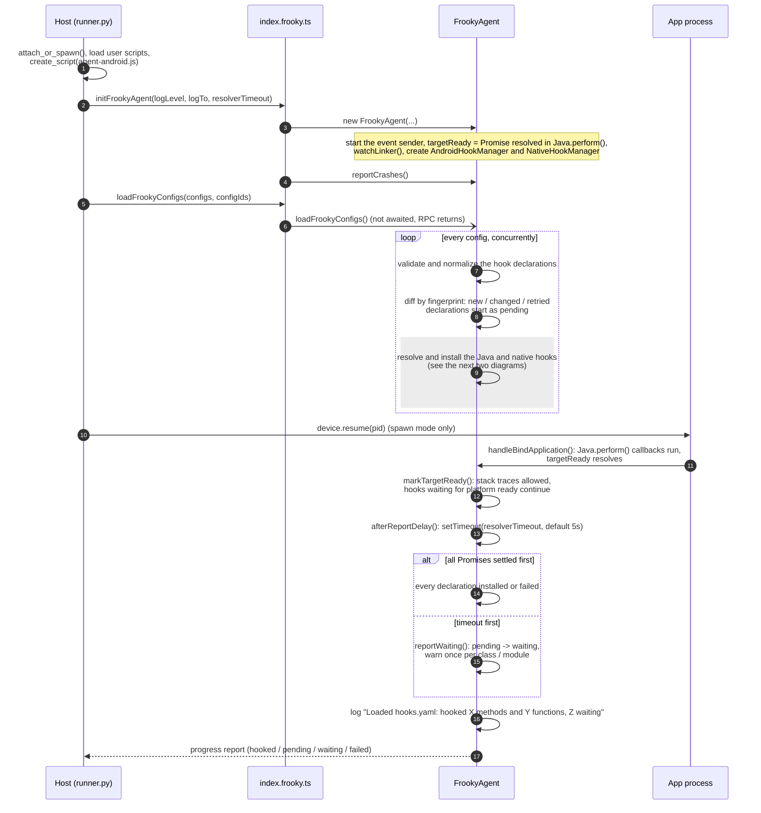
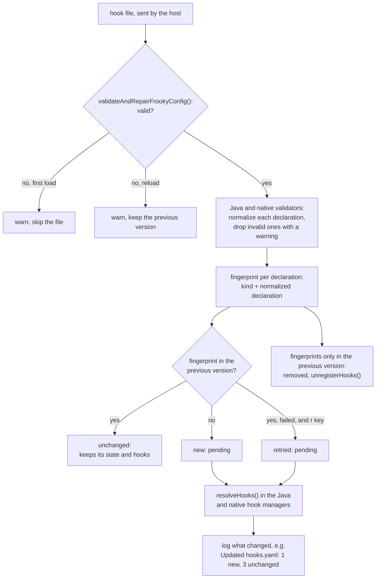
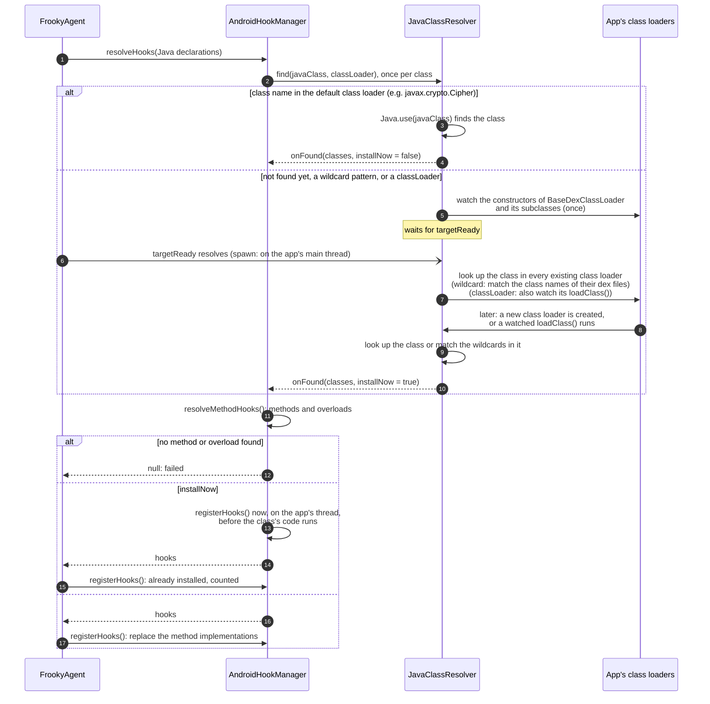
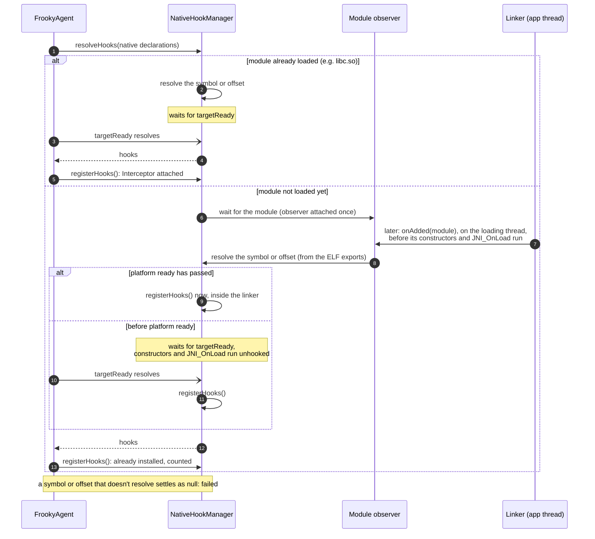
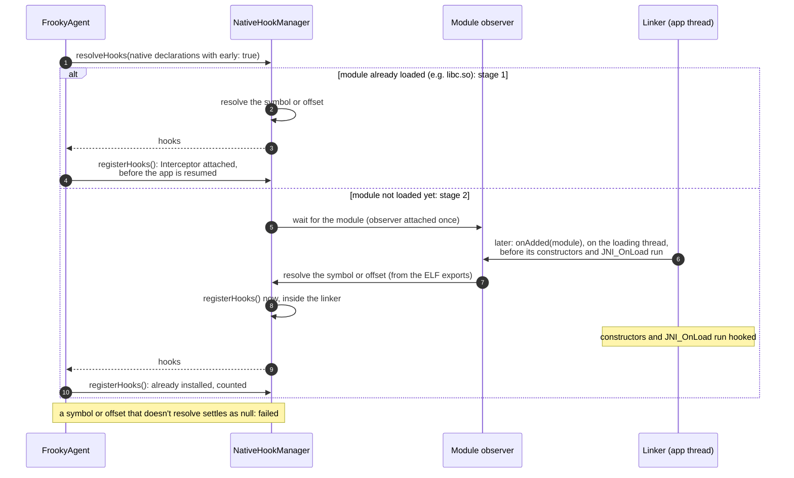
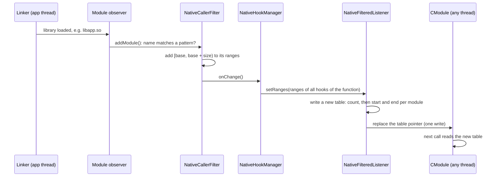

# Under the Hood

This page explains what happens between starting frooky and the moment every hook of your hook files is installed, waiting, or failed, when each kind of hook is installed, and how a hook's `callerFilter` decides which calls it records. It helps to understand why a hook shows up as `waiting`, why a call during startup was missed, why a filtered hook can still slow the app down, and where to look in the source when something doesn't get hooked.

> [!NOTE]
> For now, this page describes the Android agent. iOS support is not yet complete, see the [README](../README.md).

<!-- TOC -->

- [Overview](#overview)
- [From Start to Installed Hooks](#from-start-to-installed-hooks)
- [Loading the Hook Files](#loading-the-hook-files)
- [Installing Java Hooks](#installing-java-hooks)
- [Installing Native Hooks](#installing-native-hooks)
  - [Early Hooking](#early-hooking)
    - [Blocked Functions](#blocked-functions)
  - [Starting the Agent](#starting-the-agent)
  - [Platform Ready](#platform-ready)
  - [The Resolver Timeout and Hook States](#the-resolver-timeout-and-hook-states)
- [When a Hook Is Installed](#when-a-hook-is-installed)
  - [Java Hooks](#java-hooks)
  - [Stack Traces Before Platform Ready](#stack-traces-before-platform-ready)
- [Caller Filters](#caller-filters)
  - [The Path of a Native Call](#the-path-of-a-native-call)
  - [Which Listener a Function Gets](#which-listener-a-function-gets)
  - [Keeping the Module Ranges Current](#keeping-the-module-ranges-current)
  - [Caller Filters on Java Hooks](#caller-filters-on-java-hooks)
- [From an Event to `output.json`](#from-an-event-to-outputjson)
- [Where to Find It in the Source](#where-to-find-it-in-the-source)

<!-- /TOC -->

## Overview

frooky has two parts:

- The **host** (Python) runs on your machine. It parses the command line, connects to the device, reads your hook files, writes `output.json` and shows the status bar.
- The **agent** (TypeScript) is injected into the app by Frida. It validates the hook files, finds the classes, methods and functions they declare, installs the hooks and decodes the values.

The host starts the agent and hands it the hook files over Frida's RPC. Everything after that, from validating the hook files to installing the hooks, happens inside the app's process. The agent sends three kinds of messages back: batches of events, progress reports for the status bar, and crash reports (see [From an Event to `output.json`](#from-an-event-to-outputjson)).

## From Start to Installed Hooks

The first diagram shows the whole flow, with resolving and installing the hooks as one step (step 9). The other two diagrams show that step for [Java hooks](#installing-java-hooks) and [native hooks](#installing-native-hooks). All three show a spawn (`-f`). When attaching, the app is already running: the resume (step 10) is skipped and platform ready resolves right away.



## Loading the Hook Files

The host passes all hook files at once to `loadFrookyConfigs` (step 5). The RPC call returns right away and doesn't wait for the hooks: in spawn mode, the app stays suspended only as long as the host waits for this call.

Each hook file is then processed on its own, all of them concurrently:

1. **Validation:** `validateAndRepairFrookyConfig()` checks the file against the schema. An invalid file is skipped with a warning; the other files still load. The Java and native validators then normalize each hook declaration, e.g. expand shorthands and merge the [settings](./additional-features.md#settings-precedence), and drop invalid declarations with a warning. They also warn about risky declarations, e.g. `early: true` on a Java hook (which is ignored) or on a high-frequency libc function without a `callerFilter`.
2. **Diff:** every normalized declaration gets a fingerprint. On a [reload](./additional-features.md#hot-reloading-and-watch-mode), unchanged declarations keep their installed hooks, removed ones are unhooked, and only new, changed or retried ones are resolved. On the first load, every declaration is new and starts in the state `pending`.
3. **Resolve and install:** the Java and native declarations go to their hook managers in parallel. `resolveHooks()` returns one promise per declaration, which settles once its class or module is found and its hooks are installed, or once it is clear that the method or symbol doesn't exist.

What is installed before the app is resumed is only part of the hooks: Java hooks on classes of the default class loader (e.g. the Android framework's) and native hooks with `early: true` on modules that are already loaded. Everything else waits for platform ready or for its class or module, see [When a Hook Is Installed](#when-a-hook-is-installed).



A changed declaration has a new fingerprint, so it is removed and added again: its old hooks are unhooked and its new version is resolved and installed. The summary counts such a pair with the same target (method or symbol) as `updated`.

## Installing Java Hooks

Java hooks don't wait for platform ready: a class that the default class loader has is hooked right away (steps 3 and 4). See [Java Hooks](#java-hooks) below.



## Installing Native Hooks

By default, a native hook waits for platform ready, even if its module is loaded and its symbol resolves right away. The symbol or offset is still resolved as soon as the module is found, so a misspelled symbol fails right away.



### Early Hooking

Before platform ready, the runtime (ART) is still starting its own threads, and hooks on functions like `read` or `close` collide with them: the app can deadlock or stop responding (ANR). That's why native hooks wait by default.

`early: true` skips this wait. Use it for code that runs before platform ready, e.g. ELF constructors in `.init_array`, `JNI_OnLoad` of a library loaded at startup, or anti-tampering checks, and give a high-frequency function a `callerFilter`, see [Dangerous Low-Level, Early, and High-Frequency Hooks](./additional-features.md#dangerous-low-level-early-and-high-frequency-hooks) and the examples in [`08_early_hooking`](./examples/native/08_early_hooking/). `early` only matters when spawning (`-f`): when attaching, the app is already past platform ready.

A spawned app goes through three stages:

| Stage                                                                       | Native hooks                                                                                          | Java hooks                                                          | Stack traces                |
| --------------------------------------------------------------------------- | ----------------------------------------------------------------------------------------------------- | ------------------------------------------------------------------- | --------------------------- |
| **1. Paused at spawn** (the agent loads the hook files)                     | ⚠️ Only with `early: true`, on modules that are already loaded (e.g. `libc.so`)                       | ✅ Classes of the default class loader (e.g. `javax.crypto.Cipher`) | ❌ Skipped (`before-ready`) |
| **2. Resumed** (the process starts up, before platform ready)               | ⚠️ Only with `early: true`, in the linker while a module loads, before `.init_array` and `JNI_OnLoad` | ⏳ App classes stay `pending`                                       | ❌ Skipped (`before-ready`) |
| **3. Platform ready** (`targetReady` resolves in `handleBindApplication()`) | ✅ Every waiting hook on a loaded module is installed                                                 | ✅ App classes are looked up in the app's class loaders             | ✅ Java and native          |

Independent of the stage:

- ⚠️ An `early: true` hook on a high-frequency libc function (e.g. `read`, `close`, `malloc`) without a `callerFilter` can deadlock the app or make it stop responding (ANR) during startup. The validator warns about it.
- ⚠️ Hot-path functions (e.g. `malloc`, `free`, `memcpy`) produce a lot of events. A `callerFilter` keeps only the calls of the modules you are interested in, see [Caller Filters](#caller-filters).
- ❌ Stack traces are also skipped while any thread loads a library (`in-linker`, `linker-busy`), on a signal stack (`signal-stack`) and when little stack is left (`low-stack`), see [Skipped Stack Traces](./additional-features.md#skipped-stack-traces).

#### Blocked Functions

Hooking some low-level functions makes the app hang or crash, no matter which settings the hook uses. frooky doesn't install hooks on these functions (or, for `sigprocmask`, doesn't capture their stack traces) and logs a warning instead:

| Function                                                 | Runtime | Blocked      | Why                                                                                                                                                                                                                                             |
| -------------------------------------------------------- | ------- | ------------ | ----------------------------------------------------------------------------------------------------------------------------------------------------------------------------------------------------------------------------------------------- |
| `pthread_getspecific`, `pthread_setspecific` (`libc.so`) | all     | hook         | Frida's Interceptor uses them itself: installing the hook hangs the app.                                                                                                                                                                        |
| `dlopen` (`libdl.so`)                                    | all     | hook         | The linker picks the namespace by the caller's address, which the hook changes, so system libraries (e.g. graphics drivers) fail to load.                                                                                                       |
| `memset`, `clock_gettime` (`libc.so`)                    | V8      | hook         | V8 calls them itself while it runs a hook, which re-enters V8 and crashes the app (`SIGTRAP`). Use QuickJS to hook them.                                                                                                                        |
| `sigprocmask` (`libc.so`)                                | all     | stack traces | Its calls come from ART's signal chain wrapper in `libsigchain.so`, and Frida's accurate stack walker crashes the app (`SIGSEGV`) when it walks from there, also after platform ready. A `callerFilter` still works, as it needs no stack walk. |

The list comes from hooking about 50 low-level libc and libdl functions on Android 15, with and without stack traces, under both runtimes. `android_dlopen_ext` and `dlsym` also depend on the caller's address but didn't break the test app, so they aren't blocked. Hooks declared with `offset` aren't checked.

With `early: true`, a hook is installed as soon as its module is found: before the app is resumed (stage 1) if the module is already loaded, otherwise inside the linker while the module loads (stage 2), so its constructors and `JNI_OnLoad` run hooked.



### Starting the Agent

The host attaches to the app (`-p`/`-n`/`-N`) or spawns it (`-f`). When spawning, Frida starts the app suspended, before any of its code runs. The host loads any [custom user scripts](./additional-features.md#custom-user-scripts) first, then the agent script, and calls `initFrookyAgent` (steps 1 to 4 of the first diagram).

The `FrookyAgent` constructor sets up everything the hooks need later:

- The **event sender** batches the events of all hooks and sends them to the host.
- **`targetReady`** is a promise that resolves at [platform ready](#platform-ready), once the app's own classes can be looked up.
- **`watchLinker()`** hooks the linker's `dlopen()`/`dlclose()` entry points to know which threads are currently loading a library. While a thread is loading a library, hooks don't capture stack traces, neither on that thread nor on any other (see [Skipped Stack Traces](./additional-features.md#skipped-stack-traces)). It is installed first, so it covers the libraries that load while the hook files are processed.
- One **hook manager** per hook type: `AndroidHookManager` for Java hooks, with a `JavaClassResolver` that finds classes in every class loader, and `NativeHookManager` for native hooks.

Finally, `reportCrashes()` installs the [Native Crash Reporter](./additional-features.md#native-crash-reporter), except under V8.

### Platform Ready

Platform ready is the moment the Android runtime has the app's class loader and the app's own classes can be looked up. In the source, it is the `targetReady` promise, resolved by a `Java.perform()` callback.

- **Spawn:** `Java.perform()` queues its callback until the app process binds its application. frida-java-bridge hooks `ActivityThread.handleBindApplication()` and runs the callback on the app's main thread, before the app's `Application` class is created. So platform ready comes shortly after the host resumes the app (step 10), but before any of the app's own Java code runs.
- **Attach:** the application already exists, so platform ready resolves right away.

When platform ready resolves (steps 11 to 13):

- `markTargetReady()` allows stack traces, which are skipped before (see [Stack Traces Before Platform Ready](#stack-traces-before-platform-ready)).
- Native hooks without `early: true` whose module is loaded are installed.
- The `JavaClassResolver` looks for the waiting classes in every class loader of the app.
- The resolver timeout starts.

### The Resolver Timeout and Hook States

The resolver timeout is `-t`/`--resolver-timeout` seconds, 5 by default (see [Dynamic Class and Module Resolution](./additional-features.md#dynamic-class-and-module-resolution)), counted from platform ready. Then one of two things happens first:

- **All promises settle:** every declaration is `installed` or `failed`.
- **The timeout fires:** declarations that are still `pending` become `waiting`, with one warning per class or module they wait for.

Either way, frooky logs a summary per hook file, e.g. `Loaded hooks.yaml: hooked 12 methods and 3 functions, 1 waiting`. The timeout doesn't stop anything: waiting hooks stay registered and are installed as soon as their class or module loads.

A declaration is in one of these states, shown in the status bar and the [hook statistics](./additional-features.md#hook-statistics-i--i-key):

| State       | Meaning                                                                                    |
| ----------- | ------------------------------------------------------------------------------------------ |
| `pending`   | Being resolved: its class or module isn't found yet, or it waits for platform ready        |
| `waiting`   | Still not found after the resolver timeout; installed as soon as its class or module loads |
| `installed` | Hooked (one hook per Java overload or native function)                                     |
| `failed`    | The method, symbol or offset doesn't exist, or installing the hook failed (`not resolved`) |

The agent reports these counts to the host at most every 250 ms while they change, counting `pending` and `waiting` per class or module.

## When a Hook Is Installed

When a hook is installed decides which calls it can record: a call made before the hook is installed is missed. For an app that is spawned, the timing depends on the kind of hook, on whether its class or module is already loaded, and for native hooks on `early`. When attaching, platform ready has already passed, so every hook is installed as soon as its class or module is found.

| Hook                                                                 | Installed (spawn)                                                   |
| -------------------------------------------------------------------- | ------------------------------------------------------------------- |
| Java, class in the default class loader (e.g. `javax.crypto.Cipher`) | Before the app is resumed                                           |
| Java, class of the app or of a class loader created later            | At platform ready, or while the class loader that has it is created |
| Native, module already loaded (e.g. `libc.so`)                       | At platform ready                                                   |
| Native, `early: true`, module already loaded                         | Before the app is resumed                                           |
| Native, module loaded before platform ready                          | At platform ready, after the module's constructors and `JNI_OnLoad` |
| Native, `early: true`, module loaded before platform ready           | While the linker loads it, before its constructors and `JNI_OnLoad` |
| Native, module loaded after platform ready                           | While the linker loads it, before its constructors and `JNI_OnLoad` |

### Java Hooks

Java hooks don't wait for platform ready. `JavaClassResolver.find()` looks a class up in the default class loader first, which has the classes of the Android framework even before the app runs, and installs their hooks right away. A class that isn't found there is looked for in every class loader of the app at platform ready, and in every new `BaseDexClassLoader` (Path-, Dex-, InMemoryDex- and DelegateLastClassLoader) while it is created, before any of its code runs. See [Class Loaders](./java-hook-declaration.md#class-loaders).

`early` doesn't apply to Java hooks: the validator warns and ignores it.

### Stack Traces Before Platform Ready

Until platform ready, `detectUnsafeContext()` returns `before-ready` and hooks record their calls without stack traces, Java and native. The same applies while a thread is loading a library (`in-linker`, `linker-busy`), so calls a hook records inside a constructor or `JNI_OnLoad` have no stack trace either. See [Skipped Stack Traces](./additional-features.md#skipped-stack-traces).

## Caller Filters

A hook's [`callerFilter`](./additional-features.md#caller-filters) decides for every call whether the hook records it. Most calls of a hot function come from code you aren't interested in, so the filter mostly drops calls. What a dropped call costs depends on where the filter runs: in native code, or in JavaScript after Frida has entered the JS engine.

### The Path of a Native Call

frooky attaches one Frida Interceptor listener per hooked function, no matter how many hooks and hook files declare it. That listener is one of two kinds:

- A **`NativeFilteredListener`**: a small CModule (C code that Frida compiles in the app's process) checks the return address and only calls into JavaScript for calls from a matching module.
- The **JS listener**: Frida enters the JavaScript engine for every call, and the filter is the first thing that runs there.


The return address is read when the function is entered: on arm64 it is the link register, on x86 and x86_64 the top of the stack. No stack walk or symbol lookup is needed to filter.

A function can have several hooks, e.g. from two hook files, with different filters. The listener lets a call through if any hook's filter matches it. `enterHooks()` then checks each hook's own `callerFilter` again, so each hook records only its own calls.

Between `onEnter` and `onLeave`, the JS listener keeps a call's state on Frida's invocation context (`this`). The `NativeFilteredListener` stores a call ID in the Interceptor's per-call data instead, and JavaScript keeps the state in a map by that ID. A call with an ID of 0 never calls into JavaScript on leave.

### Which Listener a Function Gets

A call that the `NativeFilteredListener` passes on reaches JavaScript through a `NativeCallback`, not through the Interceptor. Inside it, `this.context` is the callback's own frame, not the hooked call's: the CPU registers of the call are gone. So a function only gets a `NativeFilteredListener` if none of its hooks needs them:

| All hooks of the function...            | Why                                                                                                 |
| --------------------------------------- | --------------------------------------------------------------------------------------------------- |
| have a `callerFilter`                   | a hook without one records every call, which has to enter JavaScript anyway                         |
| don't record native stack traces        | the stack walk starts at the call's registers; from the callback, Frida's own frames are in the way |
| don't decode `float` or `double` values | on x86_64 and arm64 they are in the FP registers, which are part of the CPU context                 |
| have at most 16 params                  | the CModule passes up to 16 arguments on                                                            |

Java stack traces (`platformStackTrace`), `argFilter`, `out` params, `errno` and the [checks for unsafe calls](./additional-features.md#skipped-stack-traces) work on both listeners. For the stack checks, the CModule passes an address on the calling thread's stack.

When hooks are added or removed, frooky checks the rules again and swaps the listener if needed, e.g. to the JS listener while a second hook file adds a hook with `nativeStackTrace: true` to the same function, and back once it's removed. With `-vv`, frooky logs which listener a function got and why:

```text
DEBUG  Caller filter on libc.so!malloc: checked in JS, as a hook records native stack traces
DEBUG  Caller filter on libc.so!free: checked in native code
```

If the CModule can't be compiled, every function falls back to the JS listener.

The hook statistics (`i` key) count the calls dropped by either listener in the `Filtered` column.

### Keeping the Module Ranges Current

A native `callerFilter` matches module names, but the listener compares addresses. Each filter keeps the address ranges of the loaded modules whose names match, and updates them when a module is loaded or unloaded:



Threads in the CModule read the table without a lock. `setRanges()` therefore never changes a table: it writes a new one and then replaces the pointer, so a thread sees either the old or the new table. The old tables stay allocated, as a thread may still be reading one. Before a matching module is loaded, the table is empty and every call is dropped.

### Caller Filters on Java Hooks

A Java hook has no native listener: frooky replaces the method's implementation with a JavaScript function, so every call enters JavaScript. Its `callerFilter` walks the Java stack and searches it for a matching method (see [Java Hooks](./additional-features.md#java-hooks)), which costs as much as recording `platformStackTrace`. A dropped call still runs the original method, without decoding or an event.

## From an Event to `output.json`

Hooks don't send their events one by one. The agent collects them in a queue, and the event sender sends them as one NDJSON string per batch: as soon as 200 events are queued, and otherwise every 100 ms. Progress reports and crash reports are sent as separate JSON objects.

On the host, the message handler writes every batch to `output.json` as it arrives, then updates the status bar and, with `-e`/`--print-events`, prints the events. Progress reports update the status bar's hook counts. See [Output Format](./output.md) for the events themselves.

## Where to Find It in the Source

| Step                                            | Source                                                                                                                |
| ----------------------------------------------- | --------------------------------------------------------------------------------------------------------------------- |
| Attach or spawn, RPC calls, resume              | [`frooky/runner/runner.py`](../frooky/runner/runner.py)                                                               |
| Agent messages, `output.json`                   | [`frooky/runner/messages.py`](../frooky/runner/messages.py)                                                           |
| RPC exports of the Android agent, `targetReady` | [`frooky/agent/src/android/index.frooky.ts`](../frooky/agent/src/android/index.frooky.ts)                             |
| Config loading, diff, timeout, states           | [`frooky/agent/src/FrookyAgent.ts`](../frooky/agent/src/FrookyAgent.ts)                                               |
| Event batches to the host                       | [`frooky/agent/src/shared/event/eventSender.ts`](../frooky/agent/src/shared/event/eventSender.ts)                     |
| Java hooks                                      | [`frooky/agent/src/android/hook/androidHookManager.ts`](../frooky/agent/src/android/hook/androidHookManager.ts)       |
| Finding Java classes                            | [`frooky/agent/src/android/hook/javaClassResolver.ts`](../frooky/agent/src/android/hook/javaClassResolver.ts)         |
| Native hooks, `early` and the module observer   | [`frooky/agent/src/native/hook/nativeHookManager.ts`](../frooky/agent/src/native/hook/nativeHookManager.ts)           |
| Native hook validation, blocked functions       | [`frooky/agent/src/native/hook/nativeHookValidator.ts`](../frooky/agent/src/native/hook/nativeHookValidator.ts)       |
| Linker watch and unsafe stack contexts          | [`frooky/agent/src/native/unsafeContext.ts`](../frooky/agent/src/native/unsafeContext.ts)                             |
| Native `callerFilter` and its ranges            | [`frooky/agent/src/native/nativeCallerFilter.ts`](../frooky/agent/src/native/nativeCallerFilter.ts)                   |
| `callerFilter` in native code                   | [`frooky/agent/src/native/hook/nativeFilteredListener.ts`](../frooky/agent/src/native/hook/nativeFilteredListener.ts) |
| Java `callerFilter`                             | [`frooky/agent/src/android/androidStackTrace.ts`](../frooky/agent/src/android/androidStackTrace.ts)                   |
