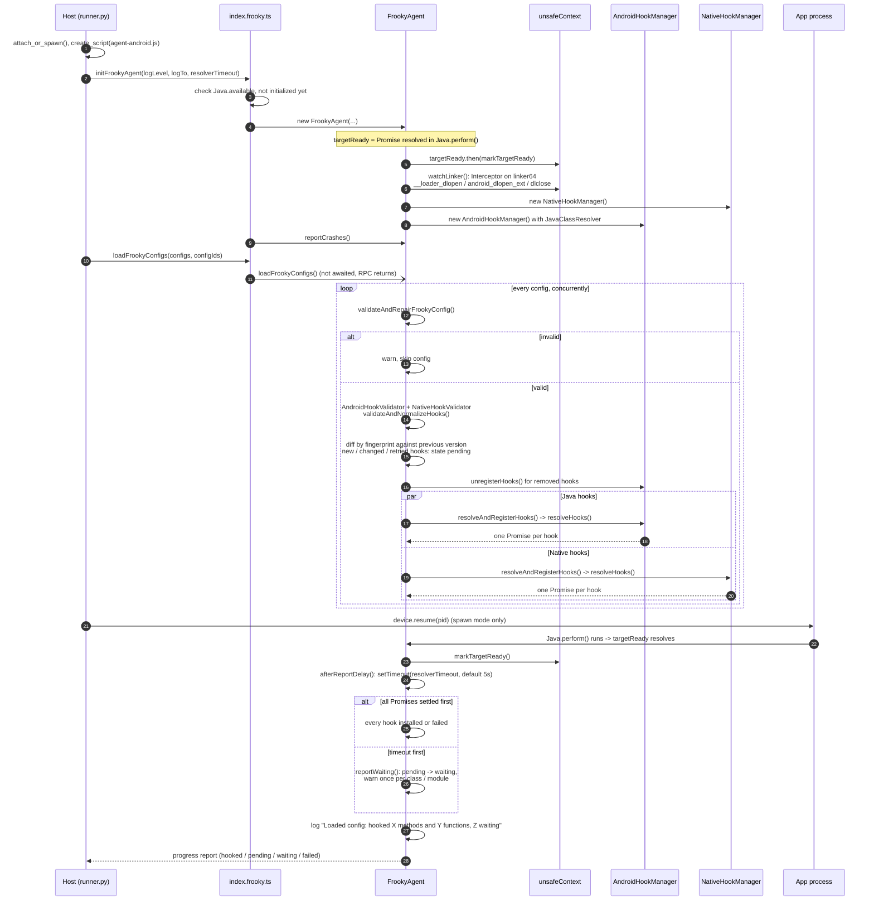

# Under the Hood

This page explains what happens between starting frooky and the moment every hook of your hook files is installed, waiting, or failed. It helps to understand why a hook shows up as `waiting`, why some hooks fire before the app's own code runs, and where to look in the source when something doesn't get hooked.

> [!NOTE]
> For now, this page describes the Android agent. iOS support is not yet complete, see the [README](../README.md).

<!-- TOC -->

- [Overview](#overview)
- [Agent Start and Config Loading](#agent-start-and-config-loading)
  - [Starting the Agent](#starting-the-agent)
  - [Loading the Hook Files](#loading-the-hook-files)
  - [Resuming the App and the Resolver Timeout](#resuming-the-app-and-the-resolver-timeout)
- [Where to Find It in the Source](#where-to-find-it-in-the-source)

<!-- /TOC -->

## Overview

frooky has two parts:

- The **host** (Python) runs on your machine. It parses the command line, connects to the device, reads your hook files and writes `output.json`.
- The **agent** (TypeScript) is injected into the app by Frida. It validates the hook files, finds the classes, methods and functions they declare, installs the hooks and decodes the values.

The host starts the agent and hands it the hook files over Frida's RPC. Everything after that, from validating the hook files to installing the hooks, happens inside the app's process.

## Agent Start and Config Loading

### Starting the Agent

The host attaches to the app (`-p`/`-n`) or spawns it (`-f`). When spawning, Frida starts the app suspended, before any of its code runs. The host then loads the agent script and calls `initFrookyAgent` (steps 1 to 4).

The `FrookyAgent` constructor sets up everything the hooks need later:

- **`targetReady`** is a promise that resolves once `Java.perform()` runs its callback, i.e. once the app's own classes can be looked up. In spawn mode, that is only after the app has been resumed.
- **`watchLinker()`** hooks the linker's `dlopen()`/`dlclose()` entry points to know which threads are currently loading a library. Hooks don't capture stack traces on these threads (see [Skipped Stack Traces](./additional-features.md#skipped-stack-traces)). It is installed first, so it covers the libraries that load while the hook files are processed.
- One **hook manager** per hook type: `AndroidHookManager` for Java hooks, with a `JavaClassResolver` that finds classes in every class loader, and `NativeHookManager` for native hooks.

Finally, `reportCrashes()` installs the [Native Crash Reporter](./additional-features.md#native-crash-reporter).

### Loading the Hook Files

The host passes all hook files at once to `loadFrookyConfigs` (step 10). The RPC call returns right away and doesn't wait for the hooks: in spawn mode, the app stays suspended only as long as the host waits for this call.

Each hook file is then processed on its own, all of them concurrently:

1. **Validation:** `validateAndRepairFrookyConfig()` checks the file against the schema. An invalid file is skipped with a warning; the other files still load. The Java and native validators then normalize each hook declaration, e.g. expand shorthands and merge the [settings](./additional-features.md#settings-precedence), and drop invalid declarations with a warning.
2. **Diff:** every normalized declaration gets a fingerprint. On a [reload](./additional-features.md#hot-reloading-and-watch-mode), unchanged declarations keep their installed hooks, removed ones are unhooked, and only new, changed or retried ones are resolved. On the first load, every declaration is new and starts in the state `pending`.
3. **Resolve and install:** the Java and native declarations go to their hook managers in parallel. `resolveHooks()` returns one promise per declaration, which settles once its class or module is found and its hooks are installed, or once it is clear that the method or symbol doesn't exist.

Everything that can be resolved right away, e.g. classes of the Android framework and modules like `libc.so` that are already loaded, is installed before `loadFrookyConfigs` returns. In spawn mode, these hooks are in place before the app's own code runs.

### Resuming the App and the Resolver Timeout

In spawn mode, the host now resumes the app (step 21). The app starts, `Java.perform()` runs, and `targetReady` resolves. From then on, the `JavaClassResolver` also looks into the app's own class loaders.

At the same moment, the resolver timeout starts: `-t`/`--resolver-timeout` seconds, 5 by default (see [Dynamic Class and Module Resolution](./additional-features.md#dynamic-class-and-module-resolution)). Then one of two things happens first:

- **All promises settle:** every declaration is `installed` or `failed`.
- **The timeout fires:** declarations that are still `pending` become `waiting`, with one warning per class or module they wait for.

Either way, frooky logs a summary per hook file, e.g. `Loaded hooks.yaml: hooked 12 methods and 3 functions, 1 waiting`, and reports the counts to the host's status bar. The timeout doesn't stop anything: waiting hooks stay registered and are installed as soon as their class or module loads.

## Where to Find It in the Source

| Step                                   | Source                                                                                                          |
| -------------------------------------- | --------------------------------------------------------------------------------------------------------------- |
| Attach or spawn, RPC calls, resume     | [`frooky/runner/runner.py`](../frooky/runner/runner.py)                                                         |
| RPC exports of the Android agent       | [`frooky/agent/src/android/index.frooky.ts`](../frooky/agent/src/android/index.frooky.ts)                       |
| Config loading, diff, timeout, states  | [`frooky/agent/src/FrookyAgent.ts`](../frooky/agent/src/FrookyAgent.ts)                                         |
| Java hooks                             | [`frooky/agent/src/android/hook/androidHookManager.ts`](../frooky/agent/src/android/hook/androidHookManager.ts) |
| Finding Java classes                   | [`frooky/agent/src/android/hook/javaClassResolver.ts`](../frooky/agent/src/android/hook/javaClassResolver.ts)   |
| Native hooks and the module observer   | [`frooky/agent/src/native/hook/nativeHookManager.ts`](../frooky/agent/src/native/hook/nativeHookManager.ts)     |
| Linker watch and unsafe stack contexts | [`frooky/agent/src/native/unsafeContext.ts`](../frooky/agent/src/native/unsafeContext.ts)                       |
