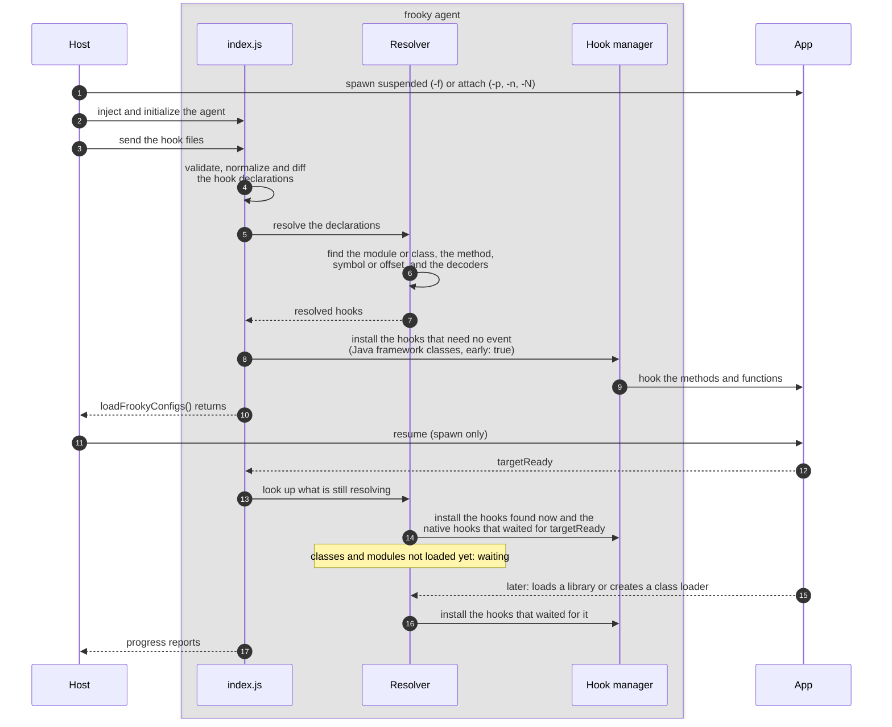
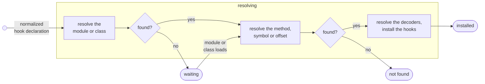
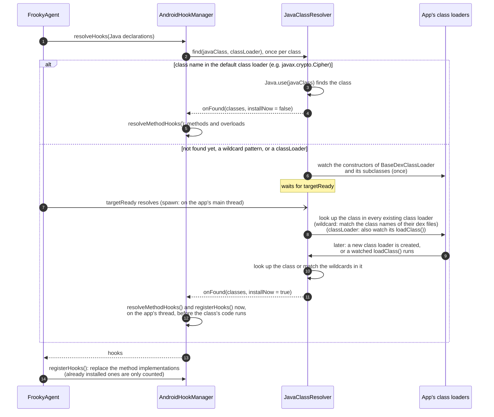
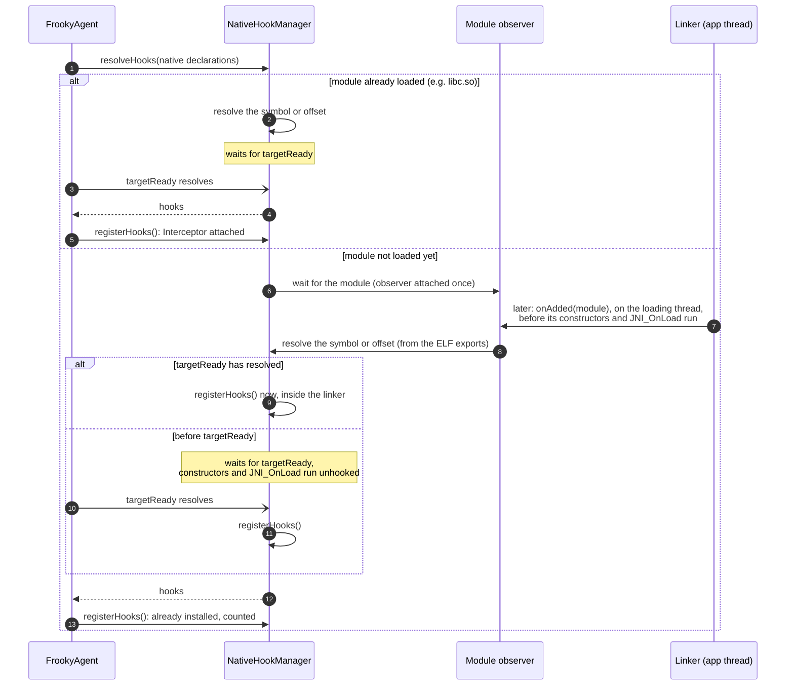
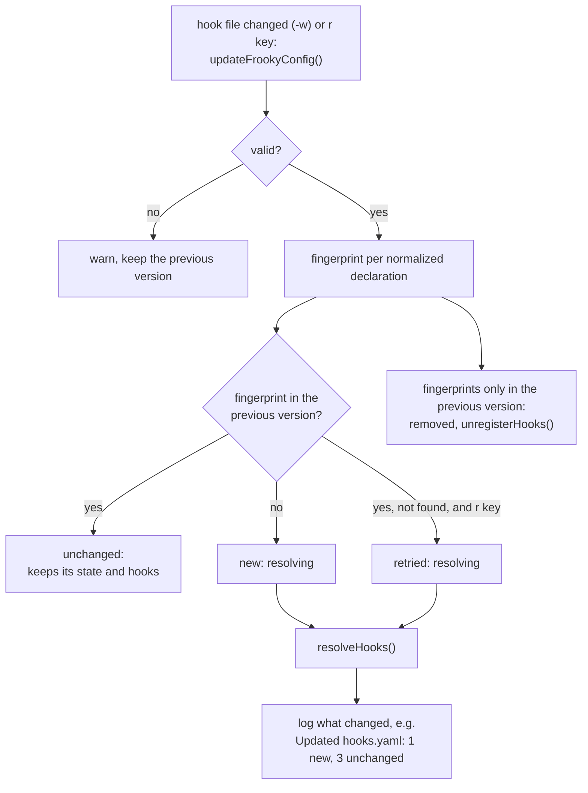
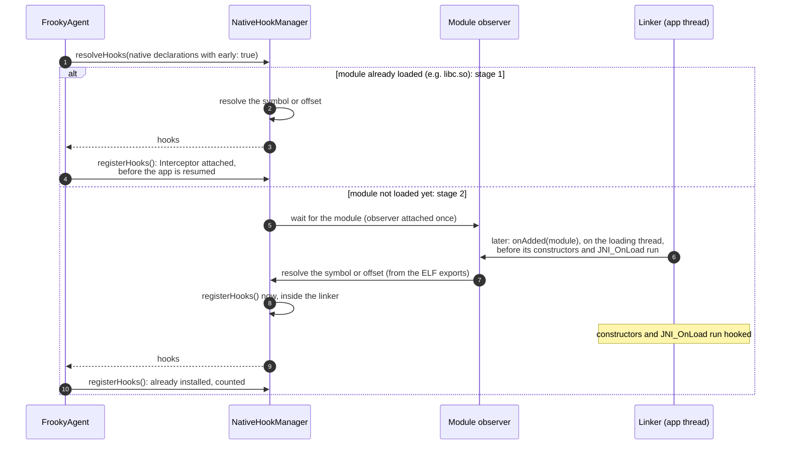
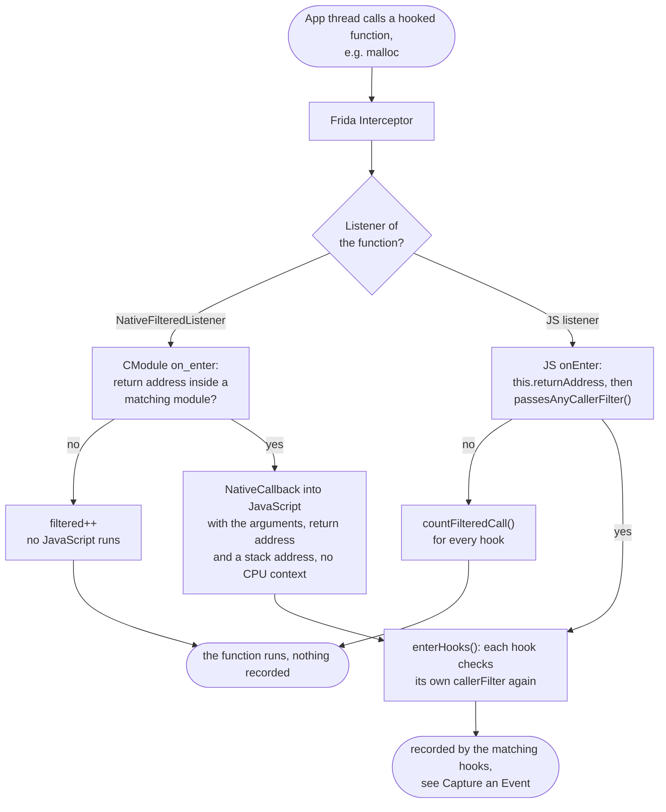
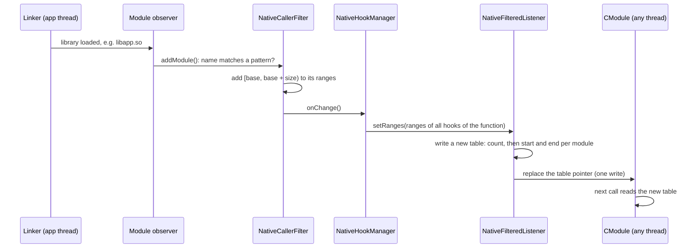

# Under the Hood

This page explains how frooky works internally: what happens to a hook from the hook file to the installed hook, when each kind of hook is installed, how a `callerFilter` decides which calls are recorded, and how events reach the host. It is optional reading for when you want to know why something behaves the way it does, e.g. why a hook shows up as `waiting`, why a call during startup was missed, or why a filtered hook still slows the app down. To learn how to use frooky, start with the [README](../README.md) and [Additional Features](./additional-features.md).

> [!NOTE]
> For now, this page describes the Android agent. iOS support is not yet complete, see the [README](../README.md).

<!-- TOC -->

- [Overview](#overview)
- [Life of a Hook](#life-of-a-hook)
  - [Hook Initialization](#hook-initialization)
  - [Validation](#validation)
  - [Normalization](#normalization)
  - [Resolve the Module or Class](#resolve-the-module-or-class)
  - [Resolve the Symbol, Offset or Method](#resolve-the-symbol-offset-or-method)
  - [Resolve Declared or Runtime Decoders](#resolve-declared-or-runtime-decoders)
  - [Install the Hook](#install-the-hook)
- [Installing Java Hooks](#installing-java-hooks)
- [Installing Native Hooks](#installing-native-hooks)
- [Blocked Native Functions](#blocked-native-functions)
- [Keeping Hooks Current](#keeping-hooks-current)
- [Early Hooking](#early-hooking)
  - [Stack Traces Before `targetReady`](#stack-traces-before-targetready)
- [Caller Filters](#caller-filters)
  - [The Path of a Native Call](#the-path-of-a-native-call)
  - [Which Listener a Function Gets](#which-listener-a-function-gets)
  - [Keeping the Module Ranges Current](#keeping-the-module-ranges-current)
  - [Caller Filters on Java Hooks](#caller-filters-on-java-hooks)
- [Capture an Event](#capture-an-event)
- [Collecting Events and Sending Them to the Host](#collecting-events-and-sending-them-to-the-host)

<!-- /TOC -->

## Overview

frooky has two parts:

- The **host** (Python) runs on your machine. It parses the command line, connects to the device, reads your hook files, writes `output.json` and shows the status bar.
- The **agent** (TypeScript) is injected into the app by Frida. It validates the hook files, finds the classes, methods and functions they declare, installs the hooks and decodes the values.

The diagram shows the simplified flow for a spawn. The **resolver** stands for everything that finds what a hook declaration names: the class or module, the method, symbol or offset in it, and the decoders for its values (steps 5 to 7), see [Life of a Hook](#life-of-a-hook). When attaching, the resume (step 11) is skipped and `targetReady` resolves right away.



The host starts the agent and hands it the hook files over Frida's RPC. Everything after that, from validating the hook files to installing the hooks, happens inside the app's process. The agent sends three kinds of messages back: batches of events, progress reports for the status bar, and crash reports (see [Collecting Events and Sending Them to the Host](#collecting-events-and-sending-them-to-the-host)).

**`targetReady`** is the moment the app's own classes can be looked up, because the Android runtime has the app's class loader. It is a promise in `FrookyAgent`, resolved by a `Java.perform()` callback. When spawning, `Java.perform()` queues its callback until the app process binds its application: frida-java-bridge hooks `ActivityThread.handleBindApplication()` and runs the callback on the app's main thread, before the app's `Application` class is created. When attaching, the application already exists and `targetReady` resolves right away. Native hooks without `early: true`, the lookups in the app's class loaders and stack traces all wait for it.

**Source:** [`frooky/runner/runner.py`](../frooky/runner/runner.py) (attach or spawn, RPC calls, resume), [`frooky/agent/src/android/index.frooky.ts`](../frooky/agent/src/android/index.frooky.ts) (RPC exports, `targetReady`), [`frooky/agent/src/FrookyAgent.ts`](../frooky/agent/src/FrookyAgent.ts)

## Life of a Hook

The host passes all hook files at once to `loadFrookyConfigs` (step 3 of the [overview](#overview)). The RPC call returns once the hook files are parsed and every hook that needs no event, i.e. neither `targetReady` nor a class or module that loads later, is resolved and installed. In spawn mode, the host resumes the app right after (step 11), so these hooks are in place before any of the app's code runs. The other hooks keep resolving after the call has returned.

A **hook file** is one YAML file, which the host sends to the agent as a config, identified by its path. After [normalization](#normalization), each method (Java) or symbol or offset (native) in it is one **hook declaration**: diffs, [states](#hook-initialization) and the hook statistics count declarations. A declaration installs one **hook** per Java overload or native function. The **hook managers** resolve and install them: `AndroidHookManager` for Java hooks and `NativeHookManager` for native hooks.

Each hook file is processed on its own, all of them concurrently. Its hook declarations are validated and normalized, compared with the previously loaded version of the file (see [Keeping Hooks Current](#keeping-hooks-current)), and the new, changed and retried ones are resolved and installed.

**Source:** [`frooky/agent/src/FrookyAgent.ts`](../frooky/agent/src/FrookyAgent.ts)

### Hook Initialization



Each [normalized](#normalization) hook declaration is initialized on its own: frooky resolves its module or class, then the method, symbol or offset in it, then the decoders for its values, and then installs its hooks: Frida's Interceptor for a native function, a replaced implementation for a Java method.

A hook declaration is in one of these states, shown in the status bar and the [hook statistics](./additional-features.md#hook-statistics-i--i-key):

| State       | Meaning                                                                                                                                                                      |
| ----------- | ---------------------------------------------------------------------------------------------------------------------------------------------------------------------------- |
| `resolving` | frooky is resolving its module or class, its method, symbol or offset, or the decoders for its values.                                                                       |
| `waiting`   | Its module or class isn't loaded yet. frooky hooks the linkers and class loaders for these modules and classes. If they are loaded later, frooky will try to hook them then. |
| `installed` | The hook is installed and ready to be called.                                                                                                                                |
| `not found` | Its module or class is there, but the method, symbol or offset isn't. frooky doesn't look for it again.                                                                      |

**Source:** [`frooky/agent/src/FrookyAgent.ts`](../frooky/agent/src/FrookyAgent.ts)

### Validation

The hook file is checked against Zod schemas, generated from the TypeScript types of the hook-file format:

- `validateAndRepairFrookyConfig()` checks the file's `metadata` and `settings`. Invalid metadata and unknown properties only cause a warning. An invalid setting is reset to its default, also with a warning, and an invalid regular expression in `callerFilter` is dropped. A file without a `hookCollection` is skipped; the other files still load.
- Each hook declaration is checked against its own schema after [normalization](#normalization). An invalid declaration is dropped with a warning; the other declarations of the file still load.

> TODO: more detail, e.g. which errors repair and which drop.

**Source:** [`frooky/agent/src/shared/configValidator.ts`](../frooky/agent/src/shared/configValidator.ts), [`frooky/agent/src/shared/inputParsing/zodSchemas/`](../frooky/agent/src/shared/inputParsing/zodSchemas/)

### Normalization

The Java and native hook validators normalize each hook declaration, e.g. expand shorthands and merge the [settings](./additional-features.md#settings-precedence). They also check what the schema can't, e.g. decoder names, and warn about risky declarations, e.g. `early: true` on a Java hook (which is ignored) or on a high-frequency libc function without a `callerFilter`. Hooks on [blocked native functions](#blocked-native-functions) are dropped here.

> TODO: more detail on the normalized form.

**Source:** [`frooky/agent/src/android/hook/androidHookValidator.ts`](../frooky/agent/src/android/hook/androidHookValidator.ts), [`frooky/agent/src/native/hook/nativeHookValidator.ts`](../frooky/agent/src/native/hook/nativeHookValidator.ts)

### Resolve the Module or Class

The Java and native declarations go to their hook managers in parallel. `resolveHooks()` returns one promise per declaration, which settles once its class or module is found and its hooks are installed, or once it is clear that the method or symbol doesn't exist.

frooky doesn't poll for classes and modules, and doesn't wait a fixed time for them. A class or module that is already loaded is found right away; native hooks without `early: true` then still wait for `targetReady`. For everything else, the hook managers are notified when the app loads code:

- **Native modules:** `NativeHookManager` attaches a Frida module observer (`Process.attachModuleObserver()`) when the first hook waits for a module. Its `onAdded` callback runs on the thread that loads the module, inside the linker, before the module's constructors and `JNI_OnLoad` run, and resolves the hooks that wait for that module.
- **Java classes:** `JavaClassResolver` looks a class up in the default class loader first, which has the Android framework's classes. Other classes are looked up once in every class loader of the app at `targetReady`, and then in every new class loader: it watches the constructors of `BaseDexClassLoader` and its subclasses, which every class loader that reads dex files runs, and looks the class up while the class loader is created, before any of its classes are used. Wildcard patterns are matched against the class names in the class loader's dex files. With `classLoader`, it also watches that class loader's `loadClass()`, for custom class loaders that define classes themselves.

So a declaration is only `resolving` until the lookups at `targetReady` have run. After that, it is `installed`, `not found`, or `waiting` for its class or module, which can load at any time while the app runs.

The hook managers report this explicitly. For each declaration, `resolveHooks()` returns either the result right away, if the first lookup decides it (its hooks, or `null` if the method, symbol or offset doesn't exist), or a promise that settles once the lookups at `targetReady` have run: with the result if they found the class or module, else with `{ waiting }`, a promise that settles once it loads. `FrookyAgent` installs the results it gets right away before `loadFrookyConfigs` returns, and marks a declaration `waiting` when its promise settles with `{ waiting }`. The details are in [Installing Java Hooks](#installing-java-hooks) and [Installing Native Hooks](#installing-native-hooks).

**Source:** [`frooky/agent/src/android/hook/javaClassResolver.ts`](../frooky/agent/src/android/hook/javaClassResolver.ts), [`frooky/agent/src/native/hook/nativeHookManager.ts`](../frooky/agent/src/native/hook/nativeHookManager.ts)

### Resolve the Symbol, Offset or Method

A native symbol or offset is resolved as soon as its module is found, also when the hook then waits for `targetReady`, so a misspelled symbol fails right away. A symbol or offset that doesn't resolve settles as `not found`.

> TODO: Java methods and overloads (`resolveMethodHooks()`), and how symbols are looked up while a module loads.

**Source:** [`frooky/agent/src/android/hook/androidHookManager.ts`](../frooky/agent/src/android/hook/androidHookManager.ts), [`frooky/agent/src/native/hook/nativeHookManager.ts`](../frooky/agent/src/native/hook/nativeHookManager.ts)

### Resolve Declared or Runtime Decoders

> TODO

### Install the Hook

When spawning, the host waits with the resume until these hooks are installed: Java hooks on classes of the default class loader (e.g. the Android framework's) and native hooks with `early: true` on modules that are already loaded. Native hooks without `early: true` on modules that are already loaded are resolved by then, but only installed at `targetReady`. Everything else waits for `targetReady` or for its class or module.

When a hook is installed decides which calls it can record: a call made before the hook is installed is missed. For an app that is spawned, the timing depends on the kind of hook, on whether its class or module is already loaded, and for native hooks on `early`. When attaching, `targetReady` has already resolved, so every hook is installed as soon as its class or module is found.

| Hook                                                                 | Installed (spawn)                                                   |
| -------------------------------------------------------------------- | ------------------------------------------------------------------- |
| Java, class in the default class loader (e.g. `javax.crypto.Cipher`) | Before the app is resumed                                           |
| Java, class of the app or of a class loader created later            | At `targetReady`, or while the class loader that has it is created  |
| Native, module already loaded (e.g. `libc.so`)                       | At `targetReady`                                                    |
| Native, `early: true`, module already loaded                         | Before the app is resumed                                           |
| Native, module loaded before `targetReady`                           | At `targetReady`, after the module's constructors and `JNI_OnLoad`  |
| Native, `early: true`, module loaded before `targetReady`            | While the linker loads it, before its constructors and `JNI_OnLoad` |
| Native, module loaded after `targetReady`                            | While the linker loads it, before its constructors and `JNI_OnLoad` |

**Source:** [`frooky/agent/src/android/hook/androidHookManager.ts`](../frooky/agent/src/android/hook/androidHookManager.ts), [`frooky/agent/src/native/hook/nativeHookManager.ts`](../frooky/agent/src/native/hook/nativeHookManager.ts)

## Installing Java Hooks

Java hooks don't wait for `targetReady`: a class that the default class loader has is hooked right away (steps 3 and 4). A class that isn't found there is looked for in every class loader of the app at `targetReady`, and in every new `BaseDexClassLoader` (Path-, Dex-, InMemoryDex- and DelegateLastClassLoader) while it is created, before any of its code runs. See [Class Loaders](./java-hook-declaration.md#class-loaders).



**Source:** [`frooky/agent/src/android/hook/androidHookManager.ts`](../frooky/agent/src/android/hook/androidHookManager.ts), [`frooky/agent/src/android/hook/javaClassResolver.ts`](../frooky/agent/src/android/hook/javaClassResolver.ts)

## Installing Native Hooks

By default, a native hook waits for `targetReady`, even if its module is loaded and its symbol resolves right away. The symbol or offset is still resolved as soon as the module is found, so a misspelled symbol fails right away. With `early: true`, it doesn't wait, see [Early Hooking](#early-hooking).



**Source:** [`frooky/agent/src/native/hook/nativeHookManager.ts`](../frooky/agent/src/native/hook/nativeHookManager.ts)

## Blocked Native Functions

Hooking some low-level functions makes the app hang or crash, no matter which settings the hook uses. frooky doesn't install hooks on these functions (or, for `sigprocmask`, doesn't capture their stack traces) and logs a warning instead:

| Function                                                 | Runtime | Blocked      | Why                                                                                                                                                                                                                                            |
| -------------------------------------------------------- | ------- | ------------ | ---------------------------------------------------------------------------------------------------------------------------------------------------------------------------------------------------------------------------------------------- |
| `pthread_getspecific`, `pthread_setspecific` (`libc.so`) | all     | hook         | Frida's Interceptor uses them itself: installing the hook hangs the app.                                                                                                                                                                       |
| `dlopen` (`libdl.so`)                                    | all     | hook         | The linker picks the namespace by the caller's address, which the hook changes, so system libraries (e.g. graphics drivers) fail to load.                                                                                                      |
| `memset`, `clock_gettime` (`libc.so`)                    | V8      | hook         | V8 calls them itself while it runs a hook, which re-enters V8 and crashes the app (`SIGTRAP`). Use QuickJS to hook them.                                                                                                                       |
| `sigprocmask` (`libc.so`)                                | all     | stack traces | Its calls come from ART's signal chain wrapper in `libsigchain.so`, and Frida's accurate stack walker crashes the app (`SIGSEGV`) when it walks from there, also after `targetReady`. A `callerFilter` still works, as it needs no stack walk. |

**Source:** [`frooky/agent/src/native/hook/nativeHookValidator.ts`](../frooky/agent/src/native/hook/nativeHookValidator.ts) (`BLOCKED_FUNCTIONS`)

## Keeping Hooks Current

Every normalized declaration gets a fingerprint. On a [reload](./additional-features.md#hot-reloading-and-watch-mode), unchanged declarations keep their installed hooks, removed ones are unhooked, and only new, changed or retried ones are resolved. On the first load, every declaration is new and starts in the state `resolving`.



A changed declaration has a new fingerprint, so it is removed and added again: its old hooks are unhooked and its new version is resolved and installed. The summary counts such a pair with the same target (method or symbol) as `updated`.

**Source:** [`frooky/agent/src/FrookyAgent.ts`](../frooky/agent/src/FrookyAgent.ts) (diff), [`frooky/runner/watcher.py`](../frooky/runner/watcher.py) (watch mode), [`frooky/runner/runner.py`](../frooky/runner/runner.py) (`r` key)

## Early Hooking

Before `targetReady`, the runtime (ART) is still starting its own threads, and hooks on functions like `read` or `close` collide with them: the app can deadlock or stop responding (ANR). That's why native hooks wait by default.

`early: true` skips this wait. Use it for code that runs before `targetReady`, e.g. ELF constructors in `.init_array`, `JNI_OnLoad` of a library loaded at startup, or anti-tampering checks, and give a high-frequency function a `callerFilter`, see [Dangerous Low-Level, Early, and High-Frequency Hooks](./additional-features.md#dangerous-low-level-early-and-high-frequency-hooks) and the examples in [`08_early_hooking`](./examples/native/08_early_hooking/). `early` only matters when spawning (`-f`): when attaching, the app is already past `targetReady`.

A spawned app goes through three stages:

1. **Paused at spawn:** Frida has started the process suspended. The agent loads the hook files, and none of the app's code runs.
2. **Resumed:** the host has resumed the app and the process starts up, but `targetReady` hasn't resolved yet. The linker can already load libraries.
3. **`targetReady`:** the app's class loader exists and the app's own code is about to run. From here on, the app runs normally.

When attaching, the app is already in stage 3. What can be hooked in each stage:

| Stage                  | Native hooks                                                                                          | Java hooks                                                          | Stack traces                |
| ---------------------- | ----------------------------------------------------------------------------------------------------- | ------------------------------------------------------------------- | --------------------------- |
| **1. Paused at spawn** | ⚠️ Only with `early: true`, on modules that are already loaded (e.g. `libc.so`)                       | ✅ Classes of the default class loader (e.g. `javax.crypto.Cipher`) | ❌ Skipped (`before-ready`) |
| **2. Resumed**         | ⚠️ Only with `early: true`, in the linker while a module loads, before `.init_array` and `JNI_OnLoad` | ⏳ App classes stay `resolving`                                     | ❌ Skipped (`before-ready`) |
| **3. `targetReady`**   | ✅ Every waiting hook on a loaded module is installed                                                 | ✅ App classes are looked up in the app's class loaders             | ✅ Java and native          |

Independent of the stage:

- ⚠️ An `early: true` hook on a high-frequency libc function (e.g. `read`, `close`, `malloc`) without a `callerFilter` can deadlock the app or make it stop responding (ANR) during startup. The validator warns about it.
- ⚠️ Hot-path functions (e.g. `malloc`, `free`, `memcpy`) produce a lot of events. A `callerFilter` keeps only the calls of the modules you are interested in, see [Caller Filters](#caller-filters).
- ❌ Stack traces are also skipped while any thread loads a library (`in-linker`, `linker-busy`), on a signal stack (`signal-stack`) and when little stack is left (`low-stack`), see [Skipped Stack Traces](./additional-features.md#skipped-stack-traces).

With `early: true`, a hook is installed as soon as its module is found: before the app is resumed (stage 1) if the module is already loaded, otherwise inside the linker while the module loads (stage 2), so its constructors and `JNI_OnLoad` run hooked.



**Source:** [`frooky/agent/src/native/hook/nativeHookManager.ts`](../frooky/agent/src/native/hook/nativeHookManager.ts) (`early`), [`frooky/agent/src/native/unsafeContext.ts`](../frooky/agent/src/native/unsafeContext.ts) (linker watch, unsafe stack contexts)

### Stack Traces Before `targetReady`

Until `targetReady`, `detectUnsafeContext()` returns `before-ready` and hooks record their calls without stack traces, Java and native. The same applies while a thread is loading a library (`in-linker`, `linker-busy`), so calls a hook records inside a constructor or `JNI_OnLoad` have no stack trace either. See [Skipped Stack Traces](./additional-features.md#skipped-stack-traces).

## Caller Filters

A hook's [`callerFilter`](./additional-features.md#caller-filters) decides for every call whether the hook records it. Most calls of a hot function come from code you aren't interested in, so the filter mostly drops calls. What a dropped call costs depends on where the filter runs: in native code, or in JavaScript after Frida has entered the JS engine.

**Source:** [`frooky/agent/src/native/nativeCallerFilter.ts`](../frooky/agent/src/native/nativeCallerFilter.ts) (native `callerFilter` and its ranges), [`frooky/agent/src/native/hook/nativeFilteredListener.ts`](../frooky/agent/src/native/hook/nativeFilteredListener.ts) (`callerFilter` in native code), [`frooky/agent/src/android/androidStackTrace.ts`](../frooky/agent/src/android/androidStackTrace.ts) (Java `callerFilter`)

### The Path of a Native Call

frooky attaches one Frida Interceptor listener per hooked function, no matter how many hooks and hook files declare it. That listener is one of two kinds:

- A **`NativeFilteredListener`**: a small CModule (C code that Frida compiles in the app's process) checks the return address and only calls into JavaScript for calls from a matching module.
- The **JS listener**: Frida enters the JavaScript engine for every call, and the filter is the first thing that runs there.



The return address is read when the function is entered: on arm64 it is the link register, on x86 and x86_64 the top of the stack. No stack walk or symbol lookup is needed to filter.

A function can have several hooks, e.g. from two hook files, with different filters. The listener lets a call through if any hook's filter matches it. `enterHooks()` then checks each hook's own `callerFilter` again, so each hook records only its own calls.

Between `onEnter` and `onLeave`, the JS listener keeps a call's state on Frida's invocation context (`this`). The `NativeFilteredListener` stores a call ID in the Interceptor's per-call data instead, and JavaScript keeps the state in a map by that ID. A call with an ID of 0 never calls into JavaScript on leave.

### Which Listener a Function Gets

A call that the `NativeFilteredListener` passes on reaches JavaScript through a `NativeCallback`, not through the Interceptor. Inside it, `this.context` is the callback's own frame, not the hooked call's: the CPU registers of the call are gone. So a function only gets a `NativeFilteredListener` if none of its hooks needs them:

| All hooks of the function...            | Why                                                                                                 |
| --------------------------------------- | --------------------------------------------------------------------------------------------------- |
| have a `callerFilter`                   | a hook without one records every call, which has to enter JavaScript anyway                         |
| don't record native stack traces        | the stack walk starts at the call's registers; from the callback, Frida's own frames are in the way |
| don't decode `float` or `double` values | on x86_64 and arm64 they are in the FP registers, which are part of the CPU context                 |
| have at most 16 params                  | the CModule passes up to 16 arguments on                                                            |

Java stack traces (`platformStackTrace`), `argFilter`, `out` params, `errno` and the [checks for unsafe calls](./additional-features.md#skipped-stack-traces) work on both listeners. For the stack checks, the CModule passes an address on the calling thread's stack.

When hooks are added or removed, frooky checks the rules again and swaps the listener if needed, e.g. to the JS listener while a second hook file adds a hook with `nativeStackTrace: true` to the same function, and back once it's removed. With `-vv`, frooky logs which listener a function got and why:

```text
DEBUG  Caller filter on libc.so!malloc: checked in JS, as a hook records native stack traces
DEBUG  Caller filter on libc.so!free: checked in native code
```

If the CModule can't be compiled, every function falls back to the JS listener.

The hook statistics (`i` key) count the calls dropped by either listener in the `Filtered` column.

### Keeping the Module Ranges Current

A native `callerFilter` matches module names, but the listener compares addresses. Each filter keeps the address ranges of the loaded modules whose names match, and updates them when a module is loaded or unloaded:



Threads in the CModule read the table without a lock. `setRanges()` therefore never changes a table: it writes a new one and then replaces the pointer, so a thread sees either the old or the new table. The old tables stay allocated, as a thread may still be reading one. Before a matching module is loaded, the table is empty and every call is dropped.

### Caller Filters on Java Hooks

A Java hook has no native listener: frooky replaces the method's implementation with a JavaScript function, so every call enters JavaScript. Its `callerFilter` walks the Java stack and searches it for a matching method (see [Java Hooks](./additional-features.md#java-hooks)), which costs as much as recording `platformStackTrace`. A dropped call still runs the original method, without decoding or an event.

## Capture an Event

> TODO: what happens on a recorded call: decoding the arguments and the return value, stack traces, `argFilter`, the re-entry guard for hook code, and the Java dispatcher. Part of the native path is shown in [The Path of a Native Call](#the-path-of-a-native-call).

**Source:** [`frooky/agent/src/native/hook/nativeHookManager.ts`](../frooky/agent/src/native/hook/nativeHookManager.ts), [`frooky/agent/src/android/hook/androidHookManager.ts`](../frooky/agent/src/android/hook/androidHookManager.ts), [`frooky/agent/src/shared/hook/hookCodeGuard.ts`](../frooky/agent/src/shared/hook/hookCodeGuard.ts), [`frooky/agent/src/native/nativeStackTrace.ts`](../frooky/agent/src/native/nativeStackTrace.ts)

## Collecting Events and Sending Them to the Host

Hooks don't send their events one by one. The agent collects them in a queue, and the event sender sends them as one NDJSON string per batch: as soon as 200 events are queued, and otherwise every 100 ms. Progress reports and crash reports are sent as separate JSON objects.

On the host, the message handler writes every batch to `output.json` as it arrives, then updates the status bar and, with `-e`/`--print-events`, prints the events. Progress reports update the status bar's hook counts. See [Output Format](./output.md) for the events themselves.

**Source:** [`frooky/agent/src/shared/event/eventSender.ts`](../frooky/agent/src/shared/event/eventSender.ts) (event batches), [`frooky/runner/messages.py`](../frooky/runner/messages.py) (agent messages, `output.json`)
